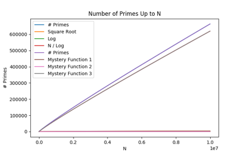
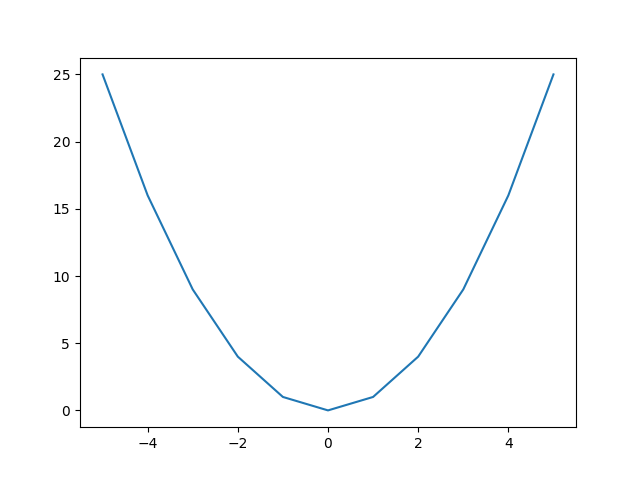
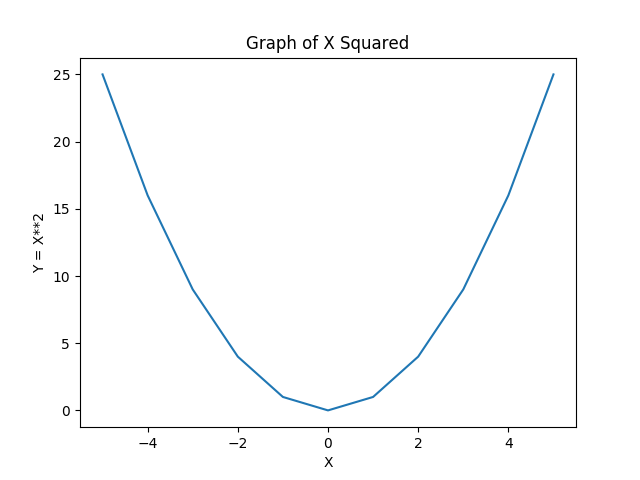
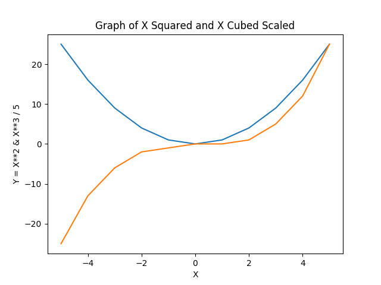
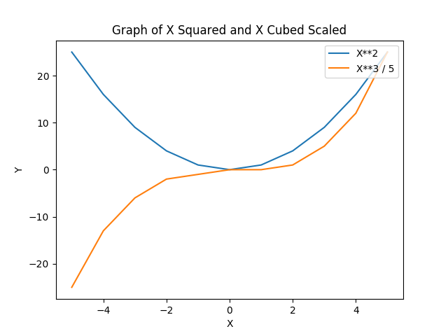
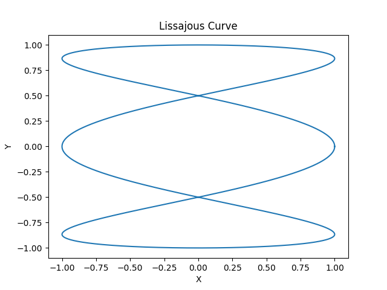

# Simple Plots: How Many Primes between 1 and N?

In this project, you will learn

* How to define your own functions in Python
* How to use unit tests to make sure your code is working
* How design decisions can impact the performance of your code
* How to create basic line graphs using matplotlib

## Project: How Many Primes Are There between 1 and N?

In the last project, we wrote a program to discover how many primes there are between 1 and 100. In this project, we'll explore how the number of primes grows as we count them from 1 to 100, 1 to 1,000, 1 to 10,000, and so on.

To do this, we will start with refactoring the solution from the previous project so that it becomes a function that can be used to find the number of primes between 1 and N. Then we can use this function to count the primes in varying ranges (e.g., up to 100, 200, 300, and so on) and display them in a graph like the following.

Of course, instead of "Mystery Functions" you will plot some actual functions that you think may be similar to the number of primes. Part of doing data science is making such educated guesses, but here are some ideas to help you get started:

* {$$}\sqrt{N}{/$$},
* {$$}N^{0.9}{/$$},
* {$$}\ln{N}{/$$},
* {$$}N / \ln{N}{/$$}, or
* {$$}\sqrt{N} / \ln{N}{/$$}.

Remember, there are at most {$$}N/2{/$$} primes from 1 to N, so all candidate functions should be smaller than that.

## Defining Functions

Functions are absolutely fundamental in programming, because they are the main mechanism for

* writing a piece of program code that can be used in many different places, and
* reducing the complexity of a program by hiding implementation details.

In fact, we have been using functions for some time. In the previous project, we used the functions `range` which produces a list of numbers, and `len` which returns the length of a string. You can see that these functions embody the two points above. `range`, for example is an extremely useful function that is called in the definition of many `for` loops. Moreover, `len` returns the length of a list, but you can use it without knowing how it is actually implemented.

What we'll do now is to define our own functions. For example, in Listing 1.17, we wrote a program that finds the sum of the numbers up to 100. It may be more useful to define a function once that can be used many times to find the numb of numbers up to `N`. Notice that by changing the limit from 100 to `N`, we are making it more likely that we can reuse this function in many different contexts.

Functions are defined using the keyword `def` as follows:

{title="Listing 2.1: Function To Find Sum of First N Positive Integers", lang=python, line-numbers=on, starting-line-number=1}
~~~~~
def sum_up_to(N):
    sum = 0                 # sum - Sum of positive integers up to i
    for i in range(1, N+1): # i - current integer to add
        sum = sum + i
    return sum
~~~~~

Line 1 of Listing 2.1 is used to define the function. Notice that the `def` keyword is followed by the name of the function, `sum_up_to` in this case, followed by the names of the function's arguments, just `N` in this case. If there are more than one arguments, they should be separated by commas.

The actual definition of the function follows in Lines 2-5. Notice that this is almost identical to Listing 1.17, except that the number 100 has been replaced by the parameter `N`. The remaining new concept is in Line 5. Most functions return a value, just like mathematical functions such as sine or square root. Line 5 specifies that the value returned by the function `sum_up_to` is the value of the variable `sum`.

Once it is defined, you can use the function `sum_up_to` just like any of the built-in Python functions. For example, you can now compute the sum of the positive integers up to 100 as follows:

{title="Listing 2.2: Sum of First 100 Positive Integers", lang=python, line-numbers=on, starting-line-number=1}
~~~~~
sum100 = sum_up_to(N)     # sum100 - Sum of positive integers up to 100
~~~~~

Let's emphasize one of the benefits of using functions. The code in Listing 2.1 is relatively simple, but it is not the fastest way to compute the value of {$$}1 + 2 + \cdots + N{/$$}. A much faster way to compute this sum was discovered by the great mathematician Gauss, who found that {$$}1 + 2 + \cdots + N = \frac{N(N+1)}{2}{/$$}. Using Gauss's trick, we can define a more efficient version of `sum_up_to` as follows:

{title="Listing 2.3: Efficient Function To Find Sum of First N Positive Integers", lang=python, line-numbers=on, starting-line-number=1}
~~~~~
def sum_up_to(N):
    return N*(N+1)//2
~~~~~

You may have noticed, however, that I can't have told you the whole story. For example, the function `range` can be called as `range(10)` or `range(2,10)`, so how can we possibly have a different number of arguments for the same function? The answer is that you can specify default values for some arguments, in which case you are allowed to leave them out when you call the function. For example, consider the function defined as follows:

{title="Listing 2.4: Function To Find Sum of Positive Integers Between M and N", lang=python, line-numbers=on, starting-line-number=1}
~~~~~
def sum_pos_ints(M, N=-1):
    if N < 0:
        N = M
        M = 1
    return sum_up_to(N) - sum_up_to(M-1)
~~~~~

With this definition, we can ask for the value of `sum_pos_ints(10)` or `sum_pos_ints(10, 15)`. The first asks for the sum of all positive integers up to 10, and notice how the `if` statement in Line 2 detects that N was not specified (since it has the default value of -1) and rearranges the parameters accordingly. When both parameters are specified, as in `sum_pos_ints(10, 15)`, the `if` statements leaves the parameters as is. In either case, the `return` statement calculates the sum of the positive integers between `M` and `N`, whether they are specified explicitly or implicitly in the function call.

When a function has optional arguments, it can be confusing to determine what values in a function call correspond to what parameters. This can be a problem even without optional arguments, e.g., when a function has many parameters so it isn't clear what the values in a function call are supposed to be. That's why Python allows you to explicitly set parameters by giving them their name. For example, all of the following will return the same value:

* `sum_pos_ints(10, 15)`
* `sum_pos_ints(10, N=15)`
* `sum_pos_ints(M=10, N=15)`

Generally speaking, I prefer the third alternative in this case because it makes it painfully clear what the arguments mean. (It would be even better if the arguments had better names, like `start` and `stop`.) In cases where the first argument is almost always relevant but the arguments with default values are rare, I may use either of the first two alternatives, though I favor the second.

Essentially, that is all there is to defining functions in Python, but there is one remaining concept that can be confusing. Variables in one function are completely separate from variables in other functions. So just because you defined the variable `sum` in the function `sum_up_to` does not mean that you can use `sum` in any other function. In a sense, this variable **belongs to** the function `sum_up_to`, so it doesn't exist outside of this function.

This is actually not as strange as it may appear at first. For example, consider the built-in function `len`. We don't know how it's implemented, but suppose it is done with a loop that counts each letter in its string argument. The number of letters may be stored in the variable `count` which is returned at the end of the function. That would be fine, unless you also have a variable called `count` in one of your functions, in which case the value of *your* variable `count` could change when you call `len`. Obviously, this would be totally unacceptable. If nothing else, how are you even supposed to know what variable names `len` uses? That's why Python treats variables in different functions as distinct, even if they have the same name.

Things are a little more complicated when you use a variable in a function *and* in the same file but outside of any function definitions, what's referred to as *global scope*. In that case, the variable in the function is the same as the one used in the file, although Python prevents you from *modifying* that variable in the function unless you explicitly mark the variable for updates. (See `global` if you're interested in doing that, but I recommend against writing code that changes global variables.) This is normally not a problem, because we generally avoid using code outside of function definitions.

## Documenting and Testing Functions

We have seen that one of the primary goals of functions is to allow code to be written once and used multiple times in many different contexts. But that means that you must be able to find out what existing functions do, so that you know *when* and *how* to call them. Moreover, when you write new functions, you should be able to help the potential users of your functions (possibly a future *you*) by writing down sufficient information about your functions so that they can learn *when* and *how* to call them.

That is the purpose of *documentation*, and we have already seen that the built-in Python functions are documented extensively, so for example you can learn all about the function `len` by looking at its documentation. In an integrated development environment or IDE, like Canopy, you can browse the official documentation in the Doc Browser, you can press a tab after a call to `len` in the Editor Window, or you can type `help(len)` or `?len` in the Python Console Window. IDEs are definitely the recommended way to program in Python, but if you must invoke Python from a shell, you can type `help(len)` to access the documentation for `len`.

The same is almost true for your functions when you provide documentation. Suppose you wrote a function called `myfn`. You, or another user of your functions, can access the documentation using the tab key in the Editor Window or by typing `help(myfn)` or `?myfn` in the Python Console.

So the remaining question is how, exactly, can you provide the adequate documentation. The Python mechanism is via a *docstring*, which is simply a string that appears immediately after the `def` line that defines your function. For example, very basic documentation can be provided as follows:

{title="Listing 2.5: Documented Function To Find Sum of First N Positive Integers", lang=python, line-numbers=on, starting-line-number=1}
~~~~~
def sum_up_to(N):
    "Find the sum of the positive integers up to a given limit."
    return N*(N+1)//2
~~~~~

Documentation should be much more extensive than the single line given above, but it is always just a string that happens to appear immediately after the definition of the function. Python supports a special syntax for strings that span multiple lines, like typical docstrings. These multiline strings are demarcated with *three* double quotes instead of just one:

{title="Listing 2.6: Documented Function To Find Sum of First N Positive Integers", lang=python, line-numbers=on, starting-line-number=1}
~~~~~
def sum_up_to(N):
    """Find the sum of the positive integers up to and including a given bound.

    Computes the sum of the numbers 1 + 2 + ... + `N`.
    """
    return N*(N+1)//2
~~~~~

This more comprehensive documentation illustrates a common convention, which is to provide a short, one-line description of the function. For many functions, this is sufficient. But if more information is useful, the single-line description can be followed by one or more paragraphs that more fully describe the function. By convention, the one-line description does not refer to the arguments by name, but the arguments can be named in the longer description, where they should be enclosed by single backquotes.

When it comes to documentation, you are bound to run into many different styles. Different programmers follow different conventions for writing docstrings. In modern Python, many if not most programmers follow a convention that was popularized by the `numpy` package, which is one of the most useful and important packages in Python. We will learn more about `numpy` in later projects, but for now we'll discuss the `numpy` convention for docstrings. According to this convention, a docstring should consist of the following:

* A single line giving a short description of the function, without any mention of the function's argument names.
* If necessary, one or more paragraphs that give a more detailed description of the function. This description can refer to the arguments by enclosing them in single backquotes. The description should describe what the function does, but it should not discuss *how* the function does it.
* A section called *Parameters*, which describes each of the parameters that the function needs. Each parameter should be described in two lines. The first has the name and *type* of the parameter, separated by a colon surrounded by a single space. The second line is indented, and it has a short description of the parameter and how it is interpreted by the function.
* A section called *Returns* that describes the value returned by the function. This is also split into two lines. The first line has the type of the return value, and the second line has a short description.
* An optional section called *Notes* that contains any extra information that may be necessary. This is the place, for example, where you can document something about the *implementation* of the function. I.e., this is where you may wish to discuss *how* the function does what it does. This is also a place where you may discuss limitations of your function, e.g., if it uses a large amount of space.
* A section called *Examples* that contains one or more example calls and the value returned by each call. The calls are given in a line that starts with ">>>" and the return value is given in the next line.

There should be a blank line between each section, and named sections should be introduced with a line that has the name of the section followed by a line with a "-" character underneath each letter in the name.

To make this convention clear, Listing 2.7 shows a fully documented version of the function `sum_up_to`:

{title="Listing 2.7: Fully Documented Function To Find Sum of First N Positive Integers", lang=python, line-numbers=on, starting-line-number=1}
~~~~~
def sum_up_to(N):
    """Find the sum of the positive integers up to and including a given bound.

    Computes the sum of the numbers 1 + 2 + ... + `N`.

    Parameters
    ----------
    N : int
        The (inclusive) upper bound for the sum.

    Returns
    -------
    int
        The sum of the numbers 1, 2, ..., `N`.

    Notes
    -----

    For efficiency, this function finds the sum of the first `N` numbers by 
    using Gauss's excellent formula for this sum:

    .. math:: \sum_{i=1}^{N}{i} = \frac{N(N+1)}{2}

    Examples
    --------
    >>> sum_up_to(0)
    0
    >>> sum_up_to(-1)
    0
    >>> sum_up_to(1)
    1
    >>> sum_up_to(4)
    10
    >>> sum_up_to(10)
    55
    """
    return N*(N+1)//2
~~~~~

Notice how each named section in Listing 2.7 is introduced by a heading followed by a line of "-" symbols. Notice also how the *Notes* section allows you to use mathematical equations. The equation is specified in LaTeX format, which is beyond the scope of this book. If you are planning on learning more about mathematics or computing, I recommend that you learn LaTeX, at least well enough to write simple documents. This [LaTeX tutorial](https://www.latex-tutorial.com) is a good place to start.

You are probably feeling a little confused (maybe even openly skeptical) that Listing 2.7 contains 35 lines of documentation for only two lines of Python code. This is a bit extreme, because this specific function is so small, just one line of code. But it is not excessive. The primary goal is to write a function once but use it multiple times. The lines of Python are for the "write once" process, but the documentation is for the many times that we plan this function to be used. So it does make sense that the documentation is longer and that it may take even more time to write than the actual function. In fact, documentation is so important that I feel it warrants another *Rule of Style*:

>    *Rule of Style #3:* Each function should *always* be extensively documented using the `numpy` docstring convention.

Before moving on, we have to address a very important topic. Let's say that you write the function `sum_up_to(N)` as above, and let's imagine that this function is used many times in the future. That's an ideal scenario, right? **But it's ideal only if the function actually works.**

So how can we be sure that the function works? The very first step, of course, is that you should convince yourself that it actually works when you are writing the function. You do this by describing to yourself the way in which the function computes the value that the documentation says it does. I.e., you describe *how* the function does *what* it does. If you're lucky, you will have a partner that will be willing to listen to your explanation and try to help you spot any flaws. In return, you should be willing to do the same for him or her.

But such informal arguments can only go so far. We are all very good at fooling ourselves. So a better way is to *test* the function by providing some input values and making sure the value returned is as expected. The more *test cases* you consider, the more certain you can be the the function works as advertised. At the very least, you should test several "common" cases and any "extreme" cases. E.g., the function may work for typical values of `N` but fail when `N` is negative or a very large positive number.

In a later project, we will consider some very good testing frameworks for Python functions. For now, we'll rely on a very simple framework that will help you gain confidence that your function really does work. The idea is to look at the *Examples* section in the documentation and make sure that all of those examples really do work. In Listing 2.7, for example, we see that the value of `sum_up_to(4)` should be 10, so we can treat `sum_up_to(4)` as a test case.

To make sure that all the examples work, all you have to do is invoke the Python framework `doctest`. You can do this with the following two lines of code, which should appear after *all* your function definitions:

{title="Listing 2.8: Testing the Examples in the Docstring", lang=python, line-numbers=on, starting-line-number=38}
~~~~~
import doctest
doctest.testmod()
~~~~~

Line 38 announces that your program needs to use the functions defined in the Python *module* called doctest. In this context, a module is simply a collection of functions, possibly written by somebody else. Line 39 then calls the function `testmod` in the `doctest` module. This function examines all of the functions defined in this file, and it executes each of the examples given in the docstrings. If all of the examples return the expected value, then `testmod` will simply finish executing without printing any messages or giving any other indication that it executed. On the other hand, if one or more of the examples returns unexpected values, `testmod` will print a summary of the offending function calls.

I cannot overemphasize how important it is that we write functions that work correctly. A subtle error in a function that is used in multiple places can wreak havoc in a large program. And finding those errors is notoriously difficult, because it is often not obvious *where* the error may be. I.e., if `sum_up_to` is used in a planetarium program that predicts the position of the stars at a given date, a small error in `sum_up_to` may yield incorrect star positions. What's worse, the programmer of the planetarium program may spend most of her time figuring out what's wrong with the large and complicated part of the program, e.g., the ephemeris calculations, and effectively ignore the "easy" stuff. So debugging the error in `sum_up_to` will be much more difficult in the context of the planetarium program than it would have been in the context of *just* `sum_up_to` at the time it was written. This is so important that it brings up another *Rule of Style*: 

>    *Rule of Style #4:* The docstring for each function should contain enough examples to reasonably ensure that the function works as expected. These examples should be tested *automatically*, e.g., with the module `testmod`.

## Lists in Python

We've seen how a Python variable can store a single number, logical value, or string that can be used in a computation. But sometimes we need to keep track of more than one value. In this project, for example, we may want to store the number of primes up to 100, 200, 300, etc. The Python mechanism for storing multiple values is called a *list*.

Python lists are written using square brackets to enclose the elements in the list. The elements are separated by commas. For example, the following are Python lists:

* `[1, 2, 3]`
* `["a", "b", "abc"]`
* `[1, "abc", False]`
* `[[1], [1, 2, 3], [1, 2, 3, 4, 5]]`
* `[]`

Notice that lists can contain any type of element, including other lists. Also, a list may contain a mixture of elements, e.g., a string and a number, although it is more common for a list to contain elements of the same type.

The number of elements in a list is called the *length* of the list, and it can be computed using the built-in Python function `len`, just like strings. So the expression `len([1, 2, 3])` is equal to three. The length of the list considers only the number of elements, so the length of the list `[[1], [1, 2, 3], [1, 2, 3, 4, 5]]` is also three. This list has only three elements, and it does not matter that, for example, the third element happens to be a list of length five.

You can access the elements of a list using an index surrounded by square brackets. For instance, suppose that `x` has the list `["a", "b", "c"]`. Then the expression `x[1]` refers to the *second* element in the list, namely "b". Remember that (for historical reasons) computer programmers routinely start counting at 0 instead of 1, so the first element of `x` is in `x[0]`, not `x[1]`. We can use this to write some code that sums the elements of a list:

{title="Listing 2.9: Adding Elements of a List", lang=python, line-numbers=on, starting-line-number=1}
~~~~~
x = [10, 20, 30]    # A list of numbers
sum = 0             # Sum of first i elements of list x
for i in range(len(x)):
    sum = sum + x[i]
~~~~~

Python makes this even easier by allowing you to loop over all the elements of the list without needing an explicit index variable `i`:

{title="Listing 2.10: Adding Elements of a List", lang=python, line-numbers=on, starting-line-number=1}
~~~~~
x = [10, 20, 30]    # A list of numbers
sum = 0             # Sum of first i elements of list x
for e in x:
    sum = sum + e
~~~~~

Notice that in this version the loop variable `e` iterates over the actual *elements* in the list (10, 20, and 30) instead of over the *indexes* in the list (0, 1, and 2).

Python lists also support negative indexes, which are interpreted as starting from the end of the list. For example, `x[-1]` is the last element of the list, `x[-2]` is the second to last element, and so on. Of course, you could also refer to the last element as `x[len(x)-1]`, but using negative indexes can be more natural.

In some applications, it is useful to access more than one element of a list at a time. This is called *slicing* in Python. For example, suppose `x` contains the list `["a", "b", "c", "d", "e"]`. Then the expression `x[1:4]` refers to the elements with index 1, 2, and 3. In other words, `x[1:4]` is the list `["b", "c", "d"]`. Notice that, like `range`, Python slices start at the lower index and go up to but do not include the upper index. So `x[1:4]` does not include the element with index 4.

If the lower or upper index in a Python slice is omitted, Python treats it as the beginning or end of the list, respectively. So `x[:3]` is the same as `x[0:3]` and `x[3:]` is the same as `x[3:5]` for a list with five elements.

Do not confuse `x[2]`, `x[2:2]`, and `x[2:3]`. The first is a single element, so it's equal to `"c"` when `x` is `["a", "b", "c", "d", "e"]`. The second one refers to an empty list, since it contains the elements of `x` with index starting with 2 and ending but not including 2. Finally, the third is a list that contains just one element, so it's equal to `["c"]`. In particular, notice that `"c"` and `["c"]` are not the same. One is a string, and the other a list.

List indexes, including slices, can be used to change the values in a list. For example, suppose `x` is equal to `["a", "b", "c", "d", "e"]`. After the statement `x[1] = "bat"` is executed, `x` will be equal to `["a", "bat", "c", "d", "e"]`. Moreover, if `x[2:4] = []` is executed, `x` will become `["a", "bat", "e"]`. And if this is followed by `x[1:2] = [1, 2, 3]`, `x` will become `["a", 1, 2, 3, "e"]`.

Slices can be used to add elements to a list, not just replace elements in a list. For example, `x[2:2] = [1, 2, 4]` inserts the elements 1, 2, and 4 right after the second element in `x`. The key to remember is that the first element of `[1, 2, 4]` will be in position 2 after the assignment. Similarly, assuming again that `x` is equal to `["a", "b", "c", "d", "e"]`, executing `x[5:] = [1, 2, 4]` will add the elements 1, 2, and 4 at the end of the list, resulting in `["a", "b", "c", "d", "e", 1, 2, 4]`.

It is more common, however, to use `append` to add an element to the end of a list. `x.append(4)` adds the number 4 to the end of the list `x`. For example, the following program will make `x` have the value `[10, 20, 30]`.

{title="Listing 2.11: Collecting Elements in a List", lang=python, line-numbers=on, starting-line-number=1}
~~~~~
x = []                # A list of positive integers up to 10*i
for i in range(1,4):  # The next integer to add
    x.append(10*i)
~~~~~

## Simple Line Graphs with Matplotlib

In order to finish the project, we need to construct basic line graphs. Luckily, Python includes an extensive yet simple-to-use module that can create many useful plots. In this section, we will scratch the surface of this module `matplotlib`, and we will be revisiting plot in future projects.

To use the module `matplotlib`, you have to import it at the top of the file, just as we did previously with the module `doctest`. If you simply import `matplotlib`, then you will need to use the entire name `matplotlib` everywhere it's used. That's a long name, so Python programmers routinely rename the module as just `plt`:

{title="Listing 2.12: Importing Matplotlib", lang=python, line-numbers=on, starting-line-number=1}
~~~~~
import matplotlib.pyplot as plt
~~~~~

The most basic line graph plots a single function of `x`. To do this, you need to collect the x and y coordinates of many points, and then pass those lists to the function `plt.plot(xs, ys)`. Note that the x and y coordinates are collected in separate lists. After calling `plt.plot(...)`, you must call `plt.show()` to create and display the graph.

For example, the following program creates a graph of the function {$$}y=x^2{/$$}.

{title="Listing 2.13: Plotting x squared", lang=python, line-numbers=on, starting-line-number=1}
~~~~~
import matplotlib.pyplot as plt

xs = range(-5, 6)       # x-coordinates of points in graph
ys = []                 # y-coordinates of points in graph (collected in loop)
for x in xs:            # x-coordinate of current point
    ys.append(x**2)
plt.plot(xs, ys)
plt.show()
~~~~~

This produces the following graph:

The graph in Figure 2.2 does a good job of suggesting what {$$}y=x^2{/$$} looks like. However, it has a major flaw in that it does not label the axes at all, so a reader unfamiliar with the graph may not have a good idea of what it shows. We can remedy this with `plt.xlabel(...)`, `plt.ylabel(...)`, and `plt.title(...)` which specify labels for the axes and the graph as a whole. This is illustrated in Listing 2.14 and Figure 2.3.

{title="Listing 2.14: Labels for Graphs", lang=python, line-numbers=on, starting-line-number=1}
~~~~~
import matplotlib.pyplot as plt

xs = range(-5, 6)       # x-coordinates of points in graph
ys = []                 # y-coordinates of points in graph (collected in loop)
for x in xs:            # x-coordinate of current point
    ys.append(x**2)
plt.plot(xs, ys)
plt.xlabel('X')
plt.ylabel('Y = X**2')
plt.title('Graph of X Squared')
plt.show()
~~~~~

Matplotlib also allows you to plot more than one function in the same graph. This can be very useful when you're trying to compare different functions qualitatively. To do this, simply collect more than one set of y-coordinates and use multiple calls of `plt.plot(...)`. For example, you can plot both {$$}x^2{/$$} and {$$}x^3{/$$} as shows in Listing 2.14.

{title="Listing 2.15: Multiple Functions in a Graph", lang=python, line-numbers=on, starting-line-number=1}
~~~~~
import matplotlib.pyplot as plt

xs = range(-5, 6)       # x-coordinates of points in graph
ys2 = []                # y-coordinates of x**2 in graph (collected in loop)
ys3 = []                # y-coordinates of x**3 / 5 in graph (collected in loop)
for x in xs:            # x-coordinate of current point
    ys2.append(x**2)
    ys3.append(x**3 / 5)
plt.plot(xs, ys2)
plt.plot(xs, ys3)
plt.xlabel('X')
plt.ylabel('Y = X**2 & X**3 / 5')
plt.title('Graph of X Squared and X Cubed Scaled')
plt.show()
~~~~~

As Figure 2.4 shows, however, the results are not perfect, because it is not obvious which is the graph of which function. To address this, we can add a legend to the graph, by adding legend text to each invocation of `plt.plot(...)` and calling `plt.legend(...)` to create the actual legend. Listing 2.16 and Figure 2.5 illustrate this approach.

{title="Listing 2.16: Multiple Functions in a Graph with a Legend", lang=python, line-numbers=on, starting-line-number=1}
~~~~~
import matplotlib.pyplot as plt

xs = range(-5, 6)       # x-coordinates of points in graph
ys2 = []                # y-coordinates of x**2 in graph (collected in loop)
ys3 = []                # y-coordinates of x**3 / 5 in graph (collected in loop)
for x in xs:            # x-coordinate of current point
    ys2.append(x**2)
    ys3.append(x**3 / 5)
plt.plot(xs, ys2, label="X**2")
plt.plot(xs, ys3, label="X**3 / 5")
plt.xlabel('X')
plt.ylabel('Y')
plt.title('Graph of X Squared and X Cubed Scaled')
plt.legend(loc="upper right")
plt.show()
~~~~~

This has been a very quick introduction to matplotlib, but you have already seen enough to produce some great graphs, and certainly enough to complete this project. 

There's just one missing part. You now know how to graph different functions of `x` on the same graph, and you can build graphs that have arithmetic expressions, like {$$}y = x^2{/$$}. But how can you plot more complicated mathematical function, like {$$}y = \ln(x){/$$} or even {$$}y = \sin(x){/$$}?

The answer is that you need to use the Python `math` module, which implements functions that calculate many common mathematical functions. As with `doctest` and `matplotlib`, the first step is to *import* the module at the top of your file, and then you can use functions such as `math.log(...)` and `math.sin(...)`, as well as constants such as `math.pi`. Note that `math.log(...)` computes the natural log of its argument, so `math.log(x)` computes {$$}\ln(x){/$$}. 
Listing 2.17 shows how you may use the `math` library to compute a more complex graph.

{title="Listing 2.17: Parametric Curve", lang=python, line-numbers=on, starting-line-number=1}
~~~~~
import matplotlib.pyplot as plt
import math

xs = []                 # x-coordinates of points in graph (collected in loop)
ys = []                 # y-coordinates of points in graph (collected in loop)
for t in range(0, 2*31416+1): # parameter value of current point
    xs.append(math.sin(3*t/10000.0 + math.pi/2))
    ys.append(math.sin(t/10000.0))
plt.plot(xs, ys)
plt.xlabel('X')
plt.ylabel('Y')
plt.title('Lissajous Curve')
plt.show()
~~~~~

## An Aside on Efficiency

You may have found that your solution to this project works correctly, but that it takes a very long time to run, particularly if you're trying to plot the number of primes up to, say 1,000,000. This a hard problem to solve because there aren't any good and efficient ways to check if a number is prime, so this program is bound to take some time.

However, some of the design decisions we made along the way can exacerbate the problem. For example, the goal is to graph the function {$$}np(n){/$$} that counts the number of primes up to {$$}n{/$$}. To do this, we need to collect many values of {$$}np(n){/$$} in a Python list, so it makes sense to create a Python function called `nprimes_up_to(n)`. In turn, this function will test many numbers to see if they're prime, so it also makes sense to turn the primality checking function into its own function called `is_prime(n)`.

Let's think about `is_prime(n)` first. The solution I used was to check whether each of the numbers 2, 3, ..., up to `n-1` are factors of n. If any of those divide `n` evenly, then `n` is not a prime. This approach is reasonable when `n` is 100, say, but it's too slow when `n` is on the order of 1,000,000. The good news is that there are at least two gross inefficiencies in this approach that are easy to solve. First of all, suppose we discover that 2 divides `n`. At this point, it is no longer necessary to consider 3, 4, ..., and so on! This should speed up the code by *at least* a factor of 2, since all even numbers will be dealt with quickly. Moreover, even if `n` is a prime so it has no factors, there is no need to consider all the numbers from 2 up to `n-1`. The truth is that we can stop as soon as we find a number `k` such that `k*k > n`. After all, if none of the numbers up to `k` are factors of `n`, then the product of any two numbers that are greater than `k` will necessarily be larger than `n` so there's no point in considering them.

We can take advantage of these two ideas by changing the code inside the function `is_prime(n)`. The simplest way to do so is to change the `for` loop in this function to a `while` loop that considers both of these ideas in order to exit the loop as early as possible. What's great about this is that the rest of the program can be completely unchanged! We simply speed up the computation of `is_prime(n)`, but other parts of the program simply continue to call this function, reaping the benefit of the speed-up without having to make any changes at all.

There is a slight drawback, however. We started with a version of `is_prime(n)` that was slow, but at least we knew that it worked correctly. How can we be sure that it still works after making these changes? To solve this conundrum, remember that we use test cases to gain confidence in the code. The test cases should be written in the docstring for the function, and the docstring did not change, since the function is still computing the *same* values. So we can simply run `doctest.testmod()` to make sure that the function still works.

What about the other opportunity for speeding up the code? The function `nprimes_up_to(n)` computes the number of primes up to `n`. But think about what happens when we call `nprimes_up_to(100)` and then `nprimes_up_to(200)`. In the second call we essentially repeate *all* the work that we did in the first. Of course, we don't need to do that in reality.

Unfortunately, fixing this takes a little more work. What needs to happen is that the function that collects the values of `nprimes_up_to(n)` needs to do so incrementally. That means that it can remember the result of `nprimes_up_to(100)`, then it needs to use that to help compute `nprimes_up_to(200)`. In practice, that means that we need to *rethink* the arguments to `nprimes_up_to(n)`. It turns out that a function called `nprimes_in_range(from_n, n)` is more useful. Listing 2.18 shows you how the number of primes can be collected.

{title="Listing 2.18: Speeding Up the Count of Primes", lang=python, line-numbers=on, starting-line-number=1}
~~~~~
nprimes = 0     # Number of primes up to N
from_n = 1      # Lower bound for # of primes in range from_n to N
for n in range(0, 10000000, 10000): # Current upper bound to check for # primes
    nprimes = nprimes + nprimes_in_range(from_n, n)
    from_n = n + 1
    # ...
~~~~~

You should be able to convince yourself that using `nprimes_in_range(...)` will give the right result, provided that the function looks for primes including both the lower and upper bound. This change will significantly speed up the code, but not without a significant cost, because it changes not just the function definition, but also the way that it is called. Thus the changes are not isolated, but may affect many pieces of code throughout the program. That's the price we have to pay some times to have efficient code.

Before ending this section, I want to emphasize that efficiency is not the only quality, not even the main quality, of great software. Most of the time, it is more important to write simple, direct code that is easy to understand, because such code is much more likely to be *right*. But in those cases where the program is unacceptably slow, you can always rethink part of your program to make it substantially faster.