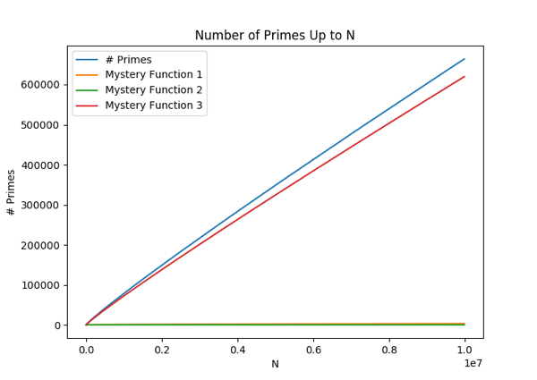

# Simple Plots: How Many Primes between 1 and N?

In this project, you will learn

* How to define your own functions in Python
* How to use unit tests to make sure your code is working
* How design decisions can impact the performance of your code
* How to create basic line graphs using matplotlib

## Project: How Many Primes Are There between 1 and N?

In the last project, we wrote a program to discover how many primes there are between 1 and 100. In this project, we'll explore how the number of primes grows as we count them from 1 to 100, 1 to 1,000, 1 to 10,000, and so on.

To do this, we will start with refactoring the solution from the previous project so that it becomes a function that can be used to find the number of primes between 1 and N. Then we can use this function to count the primes in varying ranges (e.g., up to 100, 200, 300, and so on) and display them in a graph like the following.

Of course, instead of "Mystery Functions" you will plot some actual functions that you think may be similar to the number of primes. Part of doing data science is making such educated guesses, but here are some ideas to help you get started:

* {$$}\sqrt{N}{/$$},
* {$$}N^{0.9}{/$$},
* {$$}\ln{N}{/$$},
* {$$}N / \ln{N}{/$$}, or
* {$$}\sqrt{N} / \ln{N}{/$$}.

Remember, there are at most {$$}N/2{/$$} primes from 1 to N, so all candidate functions should be smaller than that.

## Defining Functions

Functions are absolutely fundamental in programming, because they are the main mechanism for

* writing a piece of program code that can be used in many different places, and
* reducing the complexity of a program by hiding implementation details.

In fact, we have been using functions for some time. In the previous project, we used the functions `range` which produces a list of numbers, and `len` which returns the length of a string. You can see that these functions embody the two points above. `range`, for example is an extremely useful function that is called in the definition of many `for` loops. Moreover, `len` returns the length of a list, but you can use it without knowing how it is actually implemented.

What we'll do now is to define our own functions. For example, in Listing 1.17, we wrote a program that finds the sum of the numbers up to 100. It may be more useful to define a function once that can be used many times to find the numb of numbers up to `N`. Notice that by changing the limit from 100 to `N`, we are making it more likely that we can reuse this function in many different contexts.

Functions are defined using the keyword `def` as follows:

{title="Listing 2.1: Function To Find Sum of First N Positive Integers", lang=python, line-numbers=on, starting-line-number=1}
~~~~~
def sum_up_to(N):
    sum = 0                 # sum - Sum of positive integers up to i
    for i in range(1, N+1): # i - current integer to add
        sum = sum + i
    return sum
~~~~~

Line 1 of Listing 2.1 is used to define the function. Notice that the `def` keyword is followed by the name of the function, `sum_up_to` in this case, followed by the names of the function's arguments, just `N` in this case. If there are more than one arguments, they should be separated by commas.

The actual definition of the function follows in Lines 2-5. Notice that this is almost identical to Listing 1.17, except that the number 100 has been replaced by the parameter `N`. The remaining new concept is in Line 5. Most functions return a value, just like mathematical functions such as sine or square root. Line 5 specifies that the value returned by the function `sum_up_to` is the value of the variable `sum`.

Once it is defined, you can use the function `sum_up_to` just like any of the built-in Python functions. For example, you can now compute the sum of the positive integers up to 100 as follows:

{title="Listing 2.2: Sum of First 100 Positive Integers", lang=python, line-numbers=on, starting-line-number=1}
~~~~~
sum100 = sum_up_to(N)     # sum100 - Sum of positive integers up to 100
~~~~~

Let's emphasize one of the benefits of using functions. The code in Listing 2.1 is relatively simple, but it is not the fastest way to compute the value of {$$}1 + 2 + \cdots + N{/$$}. A much faster way to compute this sum was discovered by the great mathematician Gauss, who found that {$$}1 + 2 + \cdots + N = \frac{N(N+1)}{2}{/$$}. Using Gauss's trick, we can define a more efficient version of `sum_up_to` as follows:

{title="Listing 2.3: Efficient Function To Find Sum of First N Positive Integers", lang=python, line-numbers=on, starting-line-number=1}
~~~~~
def sum_up_to(N):
    return N*(N+1)//2
~~~~~

You may have noticed, however, that I can't have told you the whole story. For example, the function `range` can be called as `range(10)` or `range(2,10)`, so how can we possibly have a different number of arguments for the same function? The answer is that you can specify default values for some arguments, in which case you are allowed to leave them out when you call the function. For example, consider the function defined as follows:

{title="Listing 2.4: Function To Find Sum of Positive Integers Between M and N", lang=python, line-numbers=on, starting-line-number=1}
~~~~~
def sum_pos_ints(M, N=-1):
    if N < 0:
        N = M
        M = 1
    return sum_up_to(N) - sum_up_to(M-1)
~~~~~

With this definition, we can ask for the value of `sum_pos_ints(10)` or `sum_pos_ints(10, 15)`. The first asks for the sum of all positive integers up to 10, and notice how the `if` statement in Line 2 detects that N was not specified (since it has the default value of -1) and rearranges the parameters accordingly. When both parameters are specified, as in `sum_pos_ints(10, 15)`, the `if` statements leaves the parameters as is. In either case, the `return` statement calculates the sum of the positive integers between `M` and `N`, whether they are specified explicitly or implicitly in the function call.

When a function has optional arguments, it can be confusing to determine what values in a function call correspond to what parameters. This can be a problem even without optional arguments, e.g., when a function has many parameters so it isn't clear what the values in a function call are supposed to be. That's why Python allows you to explicitly set parameters by giving them their name. For example, all of the following will return the same value:

* `sum_pos_ints(10, 15)`
* `sum_pos_ints(10, N=15)`
* `sum_pos_ints(M=10, N=15)`

Generally speaking, I prefer the third alternative in this case because it makes it painfully clear what the arguments mean. (It would be even better if the arguments had better names, like `start` and `stop`.) In cases where the first argument is almost always relevant but the arguments with default values are rare, I may use either of the first two alternatives, though I favor the second.

Essentially, that is all there is to defining functions in Python, but there is one remaining concept that can be confusing. Variables in one function are completely separate from variables in other functions. So just because you defined the variable `sum` in the function `sum_up_to` does not mean that you can use `sum` in any other function. In a sense, this variable **belongs to** the function `sum_up_to`, so it doesn't exist outside of this function.

This is actually not as strange as it may appear at first. For example, consider the built-in function `len`. We don't know how it's implemented, but suppose it is done with a loop that counts each letter in its string argument. The number of letters may be stored in the variable `count` which is returned at the end of the function. That would be fine, unless you also have a variable called `count` in one of your functions, in which case the value of *your* variable `count` could change when you call `len`. Obviously, this would be totally unacceptable. If nothing else, how are you even supposed to know what variable names `len` uses? That's why Python treats variables in different functions as distinct, even if they have the same name.

Things are a little more complicated when you use a variable in a function *and* in the same file but outside of any function definitions, what's referred to as *global scope*. In that case, the variable in the function is the same as the one used in the file, although Python prevents you from *modifying* that variable in the function unless you explicitly mark the variable for updates. (See `global` if you're interested in doing that, but I recommend against writing code that changes global variables.) This is normally not a problem, because we generally avoid using code outside of function definitions.

## Documenting and Testing Functions

We have seen that one of the primary goals of functions is to allow code to be written once and used multiple times in many different contexts. But that means that you must be able to find out what existing functions do, so that you know *when* and *how* to call them. Moreover, when you write new functions, you should be able to help the potential users of your functions (possibly a future *you*) by writing down sufficient information about your functions so that they can learn *when* and *how* to call them.

That is the purpose of *documentation*, and we have already seen that the built-in Python functions are documented extensively, so for example you can learn all about the function `len` by looking at its documentation. In an integrated development environment or IDE, like Canopy, you can browse the official documentation in the Doc Browser, you can press a tab after a call to `len` in the Editor Window, or you can type `help(len)` or `?len` in the Python Console Window. IDEs are definitely the recommended way to program in Python, but if you must invoke Python from a shell, you can type `help(len)` to access the documentation for `len`.

The same is almost true for your functions when you provide documentation. Suppose you wrote a function called `myfn`. You, or another user of your functions, can access the documentation using the tab key in the Editor Window or by typing `help(myfn)` or `?myfn` in the Python Console.

So the remaining question is how, exactly, can you provide the adequate documentation. The Python mechanism is via a *docstring*, which is simply a string that appears immediately after the `def` line that defines your function. For example, very basic documentation can be provided as follows:

{title="Listing 2.5: Documented Function To Find Sum of First N Positive Integers", lang=python, line-numbers=on, starting-line-number=1}
~~~~~
def sum_up_to(N):
    "Find the sum of the positive integers up to a given limit."
    return N*(N+1)//2
~~~~~

Documentation should be much more extensive than the single line given above, but it is always just a string that happens to appear immediately after the definition of the function. Python supports a special syntax for strings that span multiple lines, like typical docstrings. These multiline strings are demarcated with *three* double quotes instead of just one:

{title="Listing 2.6: Documented Function To Find Sum of First N Positive Integers", lang=python, line-numbers=on, starting-line-number=1}
~~~~~
def sum_up_to(N):
    """Find the sum of the positive integers up to and including a given bound.

    Computes the sum of the numbers 1 + 2 + ... + `N`.
    """
    return N*(N+1)//2
~~~~~

This more comprehensive documentation illustrates a common convention, which is to provide a short, one-line description of the function. For many functions, this is sufficient. But if more information is useful, the single-line description can be followed by one or more paragraphs that more fully describe the function. By convention, the one-line description does not refer to the arguments by name, but the arguments can be named in the longer description, where they should be enclosed by single backquotes.

When it comes to documentation, you are bound to run into many different styles. Different programmers follow different conventions for writing docstrings. In modern Python, many if not most programmers follow a convention that was popularized by the `numpy` package, which is one of the most useful and important packages in Python. We will learn more about `numpy` in later projects, but for now we'll discuss the `numpy` convention for docstrings. According to this convention, a docstring should consist of the following:

* A single line giving a short description of the function, without any mention of the function's argument names.
* If necessary, one or more paragraphs that give a more detailed description of the function. This description can refer to the arguments by enclosing them in single backquotes. The description should describe what the function does, but it should not discuss *how* the function does it.
* A section called *Parameters*, which describes each of the parameters that the function needs. Each parameter should be described in two lines. The first has the name and *type* of the parameter, separated by a colon surrounded by a single space. The second line is indented, and it has a short description of the parameter and how it is interpreted by the function.
* A section called *Returns* that describes the value returned by the function. This is also split into two lines. The first line has the type of the return value, and the second line has a short description.
* An optional section called *Notes* that contains any extra information that may be necessary. This is the place, for example, where you can document something about the *implementation* of the function. I.e., this is where you may wish to discuss *how* the function does what it does. This is also a place where you may discuss limitations of your function, e.g., if it uses a large amount of space.
* A section called *Examples* that contains one or more example calls and the value returned by each call. The calls are given in a line that starts with ">>>" and the return value is given in the next line.

There should be a blank line between each section, and named sections should be introduced with a line that has the name of the section followed by a line with a "-" character underneath each letter in the name.

To make this convention clear, Listing 2.7 shows a fully documented version of the function `sum_up_to`:

{title="Listing 2.7: Fully Documented Function To Find Sum of First N Positive Integers", lang=python, line-numbers=on, starting-line-number=1}
~~~~~
def sum_up_to(N):
    """Find the sum of the positive integers up to and including a given bound.

    Computes the sum of the numbers 1 + 2 + ... + `N`.

    Parameters
    ----------
    N : int
        The (inclusive) upper bound for the sum.

    Returns
    -------
    int
        The sum of the numbers 1, 2, ..., `N`.

    Notes
    -----

    For efficiency, this function finds the sum of the first `N` numbers by 
    using Gauss's excellent formula for this sum:

    --math:: \sum_{i=1}^{N}{i} = \frac{N(N+1)}{2}

    Examples
    --------
    >>> sum_up_to(0)
    0
    >>> sum_up_to(-1)
    0
    >>> sum_up_to(1)
    1
    >>> sum_up_to(4)
    10
    >>> sum_up_to(10)
    55
    """
    return N*(N+1)//2
~~~~~

Notice how each named section in Listing 2.7 is introduced by a heading followed by a line of "-" symbols. Notice also how the *Notes* section allows you to use mathematical equations. The equation is specified in LaTeX format, which is beyond the scope of this book. If you are planning on learning more about mathematics or computing, I recommend that you learn LaTeX, at least well enough to write simple documents. This [LaTeX tutorial](https://www.latex-tutorial.com) is a good place to start.

You are probably feeling a little strange that Listing 2.7 contains 35 lines of documentation for only two lines of Python code. This is a bit extreme, because this specific function is so small, just one line of code. But it is not excessive. The primary goal is to write a function once but use it multiple times. The lines of Python are for the "write once" process, but the documentation is for the many times that we plan this function to be used. So it does make sense that the documentation is longer and that it may take even more time to write than the actual function. In fact, documentation is so important that I feel it warrants another *Rule of Style*:

>    *Rule of Style #3:* Each function should *always* be extensively documented using the `numpy` docstring convention.

## Lists in Python

## Simple Line Graphs with Matplotlib
