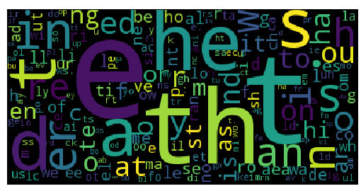

# NGrams: Frequency of Letter Pairs

In this project, you will learn

* How to use Python dictionaries to store information indexed by objects
* How to organize related functions 
* How and when to use global variables
* How to read files and process text files
* How to save Python objects in JSON files
* How to create word clouds using third-party Python libraries 

## Project: What Is the Distribution of Pairs of Letters in the English Language?

Suppose you examine a text written in the English language. You will soon be able to find some patterns, such as the fact that the letter "e" appears much more frequently than the letter "q". In this project, we are going to explore a more subtle pattern that captures the frequency of pairs of letters. For example, if you do find a letter "q", it is much more likely to be followed by the letter "u" than by the letter "e"!

Your task is to read a corpus[^corpus] of writings in English and count the number of times each pair of letters appears in the corpus. For example, you may determine that the pair "sr" occurs 278 times, and that "ux" appears only twice. The corpus is in the file "training-set.txt", and it has already been preprocessed for you. In particular, all letters are lowercased, and all punctuation marks except "." have been removed.

[^corpus]: The corpus consists of selected writings from the early years of the internet that were archived at <http://www.textfiles.com>.

In the next project, we will use this information to break an encryption scheme, so it's important to store the information regarding the pair frequencies in a way that can be used later. Originally developed in JavaScript, JSON is a popular and convenient format for storing objects in Python and other computer languages. So you should write the results of your frequency analysis in a JSON file.

T> Our approach to breaking encryption relies on the likelihood that a body of text is English by looking only at letter pairs. In order to deal with typos and texts that are nearly English, it will actually be useful to ensure that no pair of letters, no matter how infrequent, is considered totally impossible. To make sure that all pairs of letters are given non-zero probability, initialize the counts to one instead of zero before counting pairs.

Finally, it always helps to visualize the answer to make sure that it seems reasonable. One way to visualize words and their frequency is called a *word cloud*. This is a diagram that depicts each word in a canvas, where the size of each word represents the frequency of the word. For example, Figure 3.1 shows a word cloud generated from the Declaration of Independence, after removing short words such as "the" and "of". 

You should generate a similar word cloud for the frequency of letter pairs that you found in this project. For example, your word cloud should show that "th" is a very common pair of letters in English. Figure 3.2 illustrates what the answer may look like.

A> Pairs of letters are also called *bigrams*, and this idea can be easily extended to *trigrams* and so on. The general term is *ngram*, and it can be applied to analysis of contiguous letters and also words. Google has an interesting visualization of word ngrams over time, using the books that Google has digitized as the corpus. See the [Google Books Ngram Viewer](https://books.google.com/ngrams) for some interesting examples.

This project is considerably more complicated than the previous projects, so it is extremely important to organize the program properly. It is simply easier for humans to keep straight the relevant details of two small things than the details of one big thing. That's why we break programs down into small functions that do only one thing and do that thing well. In that spirit, we suggest that you follow this organization:

1. Managing the pair frequencies:
  * A global variable `_PAIR_COUNTS`.
  * `initialize_counts()` that initializes the variable `_PAIR_COUNTS`.
  * `count_pairs(s)` that counts the letter pairs in the string `s` and updates the variable `_PAIR_COUNTS` accordingly.
  * `get_all_frequencies()` that creates a Python dictionary with the frequencies of the letter pairs encountered. This uses the information in `_PAIR_COUNTS`, but scales it by the number of pairs seen, so that the results are comparable across different corpora.
2. Reading the corpus and calling `count_pairs(s)` on each line to compute the letter pair frequencies.
3. Getting the computed frequencies and generating the word cloud.

## Python Dictionaries

In the first project, we encountered Python *variables*, which allow us to store a single piece of information, for example `grade = 93`. We followed this up in the second project with Python *lists* that store several related pieces of information, such as `exams = [96, 82, 93]`. Using lists, we can refer to individual pieces of information with subscripts, such as `exams[2]` for the third exam.

In this project, we will meet Python *dictionaries* which store information that can be accessed using a name instead of a numeric index. E.g., instead of referring to the third exam, we can use Python dictionaries to access the grade in one of your classes, for example `grades["math"]` or `grades["english"]`. The word "dictionary" is meant to suggest this type of relationship. I.e., a real dictionary stores a definition for each word, so an entry may be modeled in Python as `definition["computer"]`.

Dictionaries are denoted in Python using curly braces, as in `d = {}`. Listing 3.1 shows how a dictionary may be initialized in Python.

{title="Listing 3.1: Initializing a Dictionary", lang=python, line-numbers=on, starting-line-number=1}
~~~~~
capitals = {}
capitals["Alabama"] = "Montgomery"
capitals["Alaska"] = "Juneau"
capitals["Wyoming"] = "Cheyenne"
~~~~~

Dictionaries can also be initialized in a single line by specifying a list of *keys* and *values*, as in Listing 3.2. The keys are the Python objects used to store and lookup information, and the values are the pieces of information associated with a key. In Listing 3.1, for example, `"Alabama"` is a key with the value `"Montgomery"`.

{title="Listing 3.2: Initializing a Dictionary Inline", lang=python, line-numbers=on, starting-line-number=1}
~~~~~
capitals = {"Alabama": "Montgomery",
            "Alaska": "Juneau",
            "Wyoming": "Cheyenne"
           }
~~~~~

It is sometimes useful to gather all the keys or all the values currently stored in a dictionary. A common use is to iterate over all entries in a dictionary. For instance, Listing 3.3 shows how you can increment each entry of a dictionary.

{title="Listing 3.3: Iterating over a Dictionary", lang=python, line-numbers=on, starting-line-number=1}
~~~~~
population = { "Alabama":4.863, ..., "Wyoming":0.586 }
total_pop = 0
for state in population.keys():
    total_pop = total_pop + population[state]
~~~~~

Iterating over the items in a dictionary is so common that Python provides a convenient shorthand to using `population.keys()` in the `for` loop of Listing 3.3. If you iterate over a dictionary, Python simply assumes that you wish to iterate over the keys, as seen in Listing 3.4.

{title="Listing 3.4: Iterating Implicitly over a Dictionary", lang=python, line-numbers=on, starting-line-number=1}
~~~~~
population = { "Alabama":4.863, ..., "Wyoming":0.586 }
total_pop = 0
for state in population:
    total_pop = total_pop + population[state]
~~~~~

Python dictionaries have a nasty surprise. Suppose we wish to find the population of Ontario, so we try `population["Ontario"]`. Unfortunately, the dictionary `population` has only information on the population of states in the U.S.A., not Canada, so there is no entry for `"Ontario"`. If you try to access this non-existent entry, Python will give an error and stop the execution of your program.

To avoid this, you can check to see whether the entry exists before accessing it. Python provides a simply way of doing this using the `in` operator. The expression `key in dictionary` is `True` if there is an entry for the given `key` in the `dictionary`. For example, the function in Listing 3.5 looks up the population of a state, and returns zero if the value is unknown.

{title="Listing 3.5: Checking if an Entry Exists", lang=python, line-numbers=on, starting-line-number=1}
~~~~~
def get_population(state):
    if state in population:
        return population[state]
    else:
        return 0
~~~~~

A> Looking at Listing 3.5, you may think that zero is a particularly bad value to return for the population of Toronto, just because we have no data for it. You'd be right! The problem of missing data comes up repeatedly in data science, and there are a number of ways of dealing with it. For instance, in some settings it makes sense for missing values to be replaced by an average value, so that the population of Toronto would appear to be the average population of states in the U.S.A. In this particular case, this is not really much better, so it's still not clear what would be a good value to return. For cases like this, Python offers a convenient object called `None` which is not equal to any other Python value. It is, in fact, a perfect stand-in for "We have no data for this." So more Pythonic way of writing the function in Listing 3.5 is to replace `return 0` with `return None`.

## Global Variables and Program Organization

A large part of this project involves counting the occurrence of letter pairs in a document. The counts themselves can be stored in a Python dictionary, so that, for example, `_PAIR_COUNTS["th"]` is the number of times that `"th"` is encountered in the document. The counts themselves will later be processed to compute the frequencies of the different pairs, so that we know, for example, that `"th"` occurs 2.4% of the time.

In particular, we have the Python dictionary `_PAIR_COUNTS` and three different operations:

1. initializing `_PAIR_COUNTS` to zeros,
2. adding the counts for pairs of letters in a given string, and
3. computing the final frequencies.

Moreover, the dictionary `_PAIR_COUNTS` is crucial for those three operations, but it is really not relevant anywhere else. And as a matter of style, it is downright dangerous to allow other pieces of your program to access `_PAIR_COUNTS` directly, because those pieces may be unaware of subtleties in the use of `_PAIR_COUNTS`. This may sound paranoid, but paranoia is a good habit to develop in writing code. Things *do* go wrong, and our only recourse is to write programs that are easy to think about and *fix*.

So the best practice is to organize this code in order to "hide" the dictionary `_PAIR_COUNTS` and let the rest of the program use only three functions corresponding to the three operations above. For instance, you can write the functions `initialize_counts()`, `count_pairs(s)`, and `get_all_frequencies()` that perform the operations above, and no other part of the program is allowed to use the dictionary `_PAIR_COUNTS` directly. This has two main benefits. First, it isolates the part of the program that works with the dictionary, so that if anything is wrong there, you know exactly where to look. Second, it means that the remaining parts of the program do not need to be aware of details in the way the dictionary stores information, so they can be simpler to code.

This is an example of an important technique in computing called *encapsulation*. The key idea in encapsulation is that access to some central data is controlled via a group of functions. This simplifies large programs, because most of the program does not need to know or care about the implementation of those functions, only their behavior. In a sense, this is a similar argument to defining functions, but instead of encapsulating a single function, the key idea is to encapsulate a group of related functions and possibly some central data all at once.

In order to do this, it is necessary to use *global variables*, that is variables that are accessible from multiple functions[^oop]. In the example above, `_PAIR_COUNTS` is a global variable that is accessible to the three functions `initialize_counts()`, `count_pairs(s)`, and `get_all_frequencies()`. This is done simply by setting the global variables outside of the functions, as shown in Listing 3.6.

[^oop]: In a later project, we will see a different approach to encapsulation which is superior because it completely avoids the use of these global variables. I.e., just because other parts of the program do not need to access the global variables does not mean that they won't! But using object-orientation, the encapsulation can be much stronger, effectively preventing other parts of the code from interfering (deliberately or accidentally) with the workings of the related functions that are encapsulated.

{title="Listing 3.6: Declaring a Global Variable", lang=python, line-numbers=on, starting-line-number=1}
~~~~~
_PAIR_COUNTS = {}

def initialize_counts():
    ...

def count_pairs(s):
    ...

def get_all_frequencies():
    ...
~~~~~

Recall that if two functions use the same variable name, they are actually referring to two different variables. Such variables are called *local variables*. But since `_PAIR_COUNTS` appears before any of the functions are defined, all three of them will actually refer to the same variable `_PAIR_COUNTS`. I.e., all of them will see the same Python dictionary, which happens to be empty in Listing 3.6.

Global variables are usually (always?) dangerous, because if one function makes a change to a global variable, that may cause seemingly inexplicable changes in a different function. Python partially addresses this concern by essentially disallowing inadvertent changes to global variables. For example, `initialize_counts()` should change the dictionary `_PAIR_COUNTS` by setting all its entries to zero (or better to one, as discussed previously). But if it simply makes these changes, the other two functions will not see the change. What happens is that the changes are made to a *copy* of `_PAIR_COUNTS` and then discarded after `initialize_counts()` finishes executing. In order to make the changes visible to other functions, Python requires that the function explicitly declare its intent to change the variable using the `global` keyword. This is seen in Listing 3.7.

{title="Listing 3.7: Changing a Global Variable", lang=python, line-numbers=on, starting-line-number=1}
~~~~~
_PAIR_COUNTS = {}

def initialize_counts():
    global _PAIR_COUNTS
    ...

def count_pairs(s):
    global _PAIR_COUNTS
    ...

def get_all_frequencies():
    ...
~~~~~

Notice in Listing 3.7 that both `initialize_counts()` and `count_pairs(s)` explicitly declare that `_PAIR_COUNTS` is a `global` variable, so they can make changes to it that will be visible in all other functions. This makes sense, since both of these functions are designed to alter the entries in `_PAIR_COUNTS`. On the other hand, `get_all_frequencies()` does not declare `_PAIR_COUNTS` as a `global` variable, so it cannot make any changes to its value. Again, this makes sense, because `get_all_frequencies()` is intended to retrieve the information in `_PAIR_COUNTS` but it does not need to, so it *should not*, change those counts.

## Reading and Writing Text Files

Another key component of this project is to read the large input data file "training-set.txt". Python has some mechanisms for reading text files, and we'll discuss one of the simplest in this section.

A text file is made up of many lines by an end-of-line marker, which can be either a carriage return (CR) followed by a newline (NL) or a single newline, depending on your operating system. In Python, carriage return is written as `"\r"` and newline as `"\n"`, so for example the string `"fred\nsally"` consists of two lines, one with `"fred"` on it, and the next one with '"sally"'. Note that "\n" refers to only *one* character, not two. It is the single character *NL* (or newline), not the characters *backslash* followed by the character *n*.

W> In this section, we are discussing one of Python's mechanisms for reading  *text files*, which are especially simple. However, text files do not contain any formatting or images, so it is impossible to italicize some words or to make other words bold, and there is also no way to include a figure inside a text file. In particular, files formatted with *Microsoft Word* are **not** text files, and neither are spreadsheets, image files, audio files, or movies. The methods we describe in this section cannot be used to read those files.

For concreteness, let's say that there is a file called "poem.txt" that has the following lines from Coleridge's *Kubla Khan*:

{style=poem}
~~~~~~
    In Xanadu did Kubla Khan
    A stately pleasure-dome decree:
    Where Alph, the sacred river, ran
    Through caverns measureless to man
      Down to a sunless sea.
~~~~~~

To read this file in Python, you must perform essentially three tasks:

1. **open** the file, which makes it available for reading,
2. **read** each of the lines in the file, and
3. **close** the file to let Python know that you are finished with it.

Forgetting to close the file is an extremely common error, so Python provides the `with` statement, an excellent control block that closes the file *automatically*. This is seen in Listing 3.8.

{title="Listing 3.8: Reading a File", lang=python, line-numbers=on, starting-line-number=1}
~~~~~
with open("poem.txt", "r") as f:
    contents = f.read()
# File is automatically closed after the "with" block
~~~~~

The `open()` functions takes care of step 1, and it tells Python that we intend to read from this file. In particular the second argument, `"r"`, is what tells python that we intend to *r*ead from the file. If Python cannot find the file "poem.txt", it will immediately stop and report an error. Make sure the file is where you are asking Python to find it; you may have to give a full path name, such as `"C:/Users/ruben/poem.txt"`[^baskslashes] or `"/Users/ruben/poem.txt"`.

[^backslashes]: You may be wondering why we used forward slashes in `"C:/Users/ruben/poem.txt"` instead of backward slashes as in `"C:\Users\ruben\poem.txt"`. The reason is that backward slashes have special meaning in Python, such as `"\n"` for newline or `"\r"` for carriage return. So if you need to include a backslash in a string, you actually have to specify two backslashes. We could have said `"C:\\Users\\ruben\\poem.txt"`, and that would be correct. But we decided to use forward slashes, since Python will accept either to separate directory or folder names in a file name.

If Python finds the file, then it will make it available to the remainder of your program through the new variable `f`, which is named at the end of the `with` statement in Line 1. That's what we mean by "opening" a file, just making it accessible to the rest of the program can read it. This is done in Line 2 with the expression `f.read()` which reads the entire contents of the file, including the special carriage returns and end-of-line symbols, into the variable `contents`. After the `with` statement, i.e., just before Line 3, Python will automatically `close` the file, which means that you can no longer read from it in the program. That's the great advantage of the `with` statement, that it closes the file automatically so you don't have to remember to do so.

The `f.read()` expression reads the entire contents of the file, but it's more common to read the file one line at a time. This can be done by using a `for` loop to iterate through the file, as seen in Listing 3.9.

{title="Listing 3.9: Reading a File One Line at a Time", lang=python, line-numbers=on, starting-line-number=1}
~~~~~
with open("poem.txt", "r") as f:
    for line in f:
        print (len(line))
~~~~~

The `for` loop in Line 2 will iterate over the lines in the text file "poem.txt", so it will execute five times, the first time setting `line` to `"In Xanadu did Kubla Khan"`, the second to `"A stately pleasure-dome decree:"`, and so on. The `print` statement in Line 3 will print the length of each line, so you will see the numbers 25, 32, etc.

Wait a minute! If you count the characters in `"In Xanadu did Kubla Khan"`, you will see 24 characters, not 25. Where's the extra character coming from?

If you answered "It's the newline character," you absolutely figured out how to read text files in Python. What the `for` actually does is to set the variable `line` to `"In Xanadu did Kubla Khan\n"`, then to `"A stately pleasure-dome decree:\n"`, and so on. Do not forget those newlines!

Unfortunately, those newlines are typically useless, so Python programmers generally remove them. This can be done with the function `rstrip()` as seen in Listing 3.10.

{title="Listing 3.10: Reading a File One Line at a Time without Newlines", lang=python, line-numbers=on, starting-line-number=1}
~~~~~
with open("poem.txt", "r") as f:
    for raw_line in f:
        line = raw_line.rstrip()
        print (len(line))
~~~~~

The call to `raw_line.rstrip()` removes any *whitespace* at the end of `raw_line`. "Whitespace" refers to all those unprintable characters that are meant to separate words of text, such as spaces, tabs, carriage returns, and newlines. The first "r" in `rstrip()` refers to the *right* side of the string, or its end. You can also remove whitespace characters from the front or *left* side of the string with `lstrip()`, and from both the left and the right of the string with `strip()`. 

In some cases, you will want to remove some whitespace characters from the end of the string, but not all. For example, you may want to remove carriage returns and newlines, but not spaces or tabs. The `rstrip()` function lets you specify which characters to remove, so you can say `raw_line.rstrip("\r\n")` for example. Notice that the call to `rstrip("\r\n")` specifies both carriage returns and newlines, so both will be removed. If the line has only newlines, those will be removed. So using `rstrip("\r\n")` works both under Microsoft Windows, which uses a carriage return followed by a newline to terminate lines, and under Linux, which uses a single newline to terminate lines.

To write text to a file, you need to open the file in write mode (i.e., `"w"` instead of `"r"` in the call to `open()`), then you can use the `write()` function. You should explicitly include newlines, so if `f` is a file that is open for writing, you can say `f.write("hello\n")` to write a new line with just the string `"hello"` on it. You can call `f.write()` as many times as you need. It is very common, for example, to write the file one line at a time, as seen in Listing 3.11.

{title="Listing 3.11: Writing to a File", lang=python, line-numbers=on, starting-line-number=1}
~~~~~
with open("output.txt", "w") as f:
    for i in range(10):
        f.write("line {}\n".format(i))
~~~~~

Notice how each line written to the output file ends in a newline. You may be concerned that this will not work properly under Microsoft Windows, since it uses a carriage return followed by a newline to separate lines. However, this is one place that Python betrays its origins in Unix systems. It simply allows you to use newlines to separate lines, and it converts the newlines to whatever convention is used in the operating system where it is running. In other words, you can simply use `"\n"` when writing, and Python will output a single newline in Linux and Mac systems, and a carriage return followed by a newline in Microsoft systems. In other words, just use `"\n"` and Python will do the Right Thing.

## Testing Functions that Return Dictionaries

As we saw in previous projects, it is very important that you test each function on its own. We used examples to specify what value should be returned from the function, such as `f(3)` should return `6`. That's easy enough when functions return simple objects like integers, but what do we do if the function returns a dictionary?

One of the problems is that dictionaries, by their very nature, do not have any sense of order. For example, the following two dictionaries should be completely identical in Python:

* `x = {'a': 1, 'b': 2}`
* `y = {'b': 2, 'a': 2}`

What should matter is the entries in the dictionary, not the order in which they appear. But `doctest` does not do any special processing for dictionaries, so you will need to.

There are some approaches that you can follow. One is to make sure you are listing the entries in a specific order. You can do that by converting the dictionary to a list (which *is* ordered), and then sorting that list so that the entries appear in a predictable order. For example, both of the following expressions will list the entries in the same order:

* `sorted(x.items())`
* `sorted(y.items())`

This means that if `f()` is a function that returns a dictionary like the ones above, you can test it as follows:

~~~~~
>>> sorted(construct_dictionary().items())
[('a', 1), ('b', 2)]
~~~~~

Notice that the result is a list, so you can be sure it will always be in this particular order.

Another option is to test individual entries in the dictionary. For example, you can check that the value of `a` is 1 and the value of `b` is 2:

~~~~~
>>> result = construct_dictionary()
>>> result['a']
1
>>> result['b']
2
~~~~~

This brings up one remaining point. What if the values in the dictionary are floats? Then the answer isn't `1` exactly; it may be `1.00000001` instead! To avoid this, use an explicit comparison test:

~~~~~
>>> result = construct_dictionary()
>>> abs(result['a']-1) <= 0.0001
True
>>> abs(result['b']-2) <= 0.0001
True
~~~~~

The `0.0001` is a tolerance, so numbers in the range `0.9999` to `1.0001` will be considered equal to 1, as far as testing is concerned. This is usually correct, since the actual values may differ depending on the actual computer where the program is executed.

## JSON

Up to this point, we have been building projects that do all of their own work. But this project calculates the frequency of letter pairs, and those frequencies will be used in the next project. So now we have to discuss how one program can produce an output that another program can read.

There have been many different solutions to this problem in the history of computing. A solution that is favored by many programmers is to use JSON, which is a text notation for representing numbers, strings, lists, and dictionaries. I.e., JSON can store the types of Python objects that we have used so far, store them in a text file, and retrieve them from a text file. Although we will not take advantage of this feature in any of our projects, JSON is also an attractive solution because it can be used in almost any programming language. For example, it was originally developed in JavaScript, and in fact JSON stands for "**J**ava**S**cript **O**bject **N**otation", but you can read and write JSON in Python, Java, C#, etc.

Writing a JSON file is trivial in Python.  First you need to `import` the module `json`, then you can call `json.dump(object, file)` to write the Python object `object` to the file `file`, which should be open for writing. This is shown in Listing 3.12.

{title="Listing 3.12: Writing to a File", lang=python, line-numbers=on, starting-line-number=1}
~~~~~
import json

population = { "Alabama":4.863, ..., "Wyoming":0.586 }
with open("output.json", "w") as f:
    json.dump(population, f)
~~~~~

To read the dictionary from the file, use the function `json.load(f)` where `f` is a file that is opened for reading. This is shown in Listing 3.13.

{title="Listing 3.13: Writing to a File", lang=python, line-numbers=on, starting-line-number=1}
~~~~~
import json

with open("output.json", "r") as f:
    population = json.load(f)
~~~~~

After the code in Listing 3.13 the variable `population` will have whatever was previously dumped in the file `"output.json"`. If it is executed after the program in Listing 3.12, `population` will have the dictionary created in Line 3 and saved as JSON in Line 5 of Listing 3.12. In other words, `population["Alabama"]` will be `4.863`, and so on.

## Creating Word Clouds

The last portion of this project is to create a word cloud that illustrates the letter pair frequencies. A word cloud is a diagram that depicts each word, where the size of each word represents the frequency of the word. Creating word clouds from scratch is quite challenging, but one of the great things about Python is that many contributors write useful modules and make them available through the internet.

Luckily for us, Andreas Mueller wrote an excellent module to create word clouds in Python using matplotlib. You can find installation and usage instructions in <https://github.com/amueller/word_cloud>.
Once you have the package installed, you can generate a word cloud using code similar to the one in Listing 3.14.

{title="Listing 3.14: Creating a Word Cloud", lang=python, line-numbers=on, starting-line-number=1}
~~~~~
import matplotlib.pyplot as plt
import wordcloud as wc

freqs = {"cat": 0.5, "dog":0.4, "fish":0.1}
wcloud = wc.WordCloud().generate_from_frequencies(freqs)
plt.imshow(wcloud)
plt.axis("off")
plt.show()
~~~~~

The important line is Line 5 which creates the word cloud image. The `freqs` is a Python dictionary, where the keys are the words and the values are the probabilities or frequencies of each word. This is exactly the format that should be produced by the function `get_all_frequencies()`. The last three lines in Listing 3.14 use matplotlib to display the image created by the word cloud module.  Line 6 actually draws the image, and Line 8 displays the matplotlib window. Line 7 turns off the default matplotlib x and y axes, since we are displaying an image, and not building a graph.
