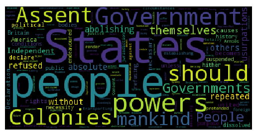

# NGrams: Frequency of Letter Pairs

In this project, you will learn

* How to use Python dictionaries to store information indexed by objects
* How to organize related functions 
* How and when to use global variables
* How to read files and process text files
* How to save Python objects in JSON files
* How to create word clouds using third-party Python libraries 

## Project: What Is the Distribution of Pairs of Letters in the English Language?

Suppose you examine a text written in the English language. You will soon be able to find some patterns, such as the fact that the letter "e" appears much more frequently than the letter "q". In this project, we are going to explore a more subtle pattern that captures the frequency of pairs of letters. For example, if you do find a letter "q", it is much more likely to be followed by the letter "u" than by the letter "e"!

Your task is to read a corpus[^corpus] of writings in English and count the number of times each pair of letters appears in the corpus. For example, you may determine that the pair "sr" occurs 278 times, and that "ux" appears only twice. The corpus is in the file "training-set.txt", and it has already been preprocessed for you. In particular, all letters are lowercased, and all punctuation marks except "." have been removed.

[^corpus]: The corpus consists of selected writings from the early years of the internet that were archived at <http://www.textfiles.com>.

In the next project, we will use this information to break an encryption scheme, so it's important to store the information regarding the pair frequencies in a way that can be used later. Originally developed in JavaScript, JSON is a popular and convenient format for storing objects in Python and other computer languages. So you should write the results of your frequency analysis in a JSON file.

T> Our approach to breaking encryption relies on the likelihood that a body of text is English by looking only at letter pairs. In order to deal with typos and texts that are nearly English, it will actually be useful to ensure that no pair of letters, no matter how infrequent, is considered totally impossible. To make sure that all pairs of letters are given non-zero probability, initialize the counts to one instead of zero before counting pairs.

Finally, it always helps to visualize the answer to make sure that it seems reasonable. One way to visualize words and their frequency is called a *word cloud*. This is a diagram that depicts each word in a canvas, where the size of each word represents the frequency of the word. For example, Figure 3.1 shows a word cloud generated from the Declaration of Independence, after removing short words such as "the" and "of". 

You should generate a similar word cloud for the frequency of letter pairs that you found in this project. For example, your word cloud should show that "th" is a very common pair of letters in English. Figure 3.2 illustrates what the answer may look like.

A> Pairs of letters are also called *bigrams*, and this idea can be easily extended to *trigrams* and so on. The general term is *ngram*, and it can be applied to analysis of contiguous letters and also words. Google has an interesting visualization of word ngrams over time, using the books that Google has digitized as the corpus. See the [Google Books Ngram Viewer](https://books.google.com/ngrams) for some interesting examples.

This project is considerably more complicated than the previous projects, so it is extremely important to organize the program properly. It is simply easier for humans to keep straight the relevant details of two small things than the details of one big thing. That's why we break programs down into small functions that do only one thing and do that thing well. In that spirit, we suggest that you follow this organization:

1. Managing the pair frequencies:
  * A global variable `_PAIR_COUNTS`.
  * `initialize_counts()` that initializes the variable `_PAIR_COUNTS`.
  * `count_pairs(s)` that counts the letter pairs in the string `s` and updates the variable `_PAIR_COUNTS` accordingly.
  * `get_all_frequencies()` that creates a Python dictionary with the frequencies of the letter pairs encountered. This uses the information in `_PAIR_COUNTS`, but scales it by the number of pairs seen, so that the results are comparable across different corpora.
2. Reading the corpus and calling `count_pairs(s)` on each line to compute the letter pair frequencies.
3. Getting the computed frequencies and generating the word cloud.

## Python Dictionaries

## Global Variables and Program Organization

## Reading and Writing Text Files

## JSON

## Creating Word Clouds