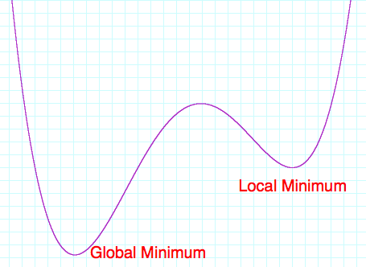

# Using Ngrams: Breaking Caesar Cyphers

In this project, you will learn

* How to implement a random walk
* How to read JSON files into Python objects

## Project: What Does This Say?

When Julius Caesar commanded the Roman 13th Legion, he needed a way to send orders to his generals that could not be read by the enemy. He developed a simple way of doing so by shifting letters. For example, a simple substitution of one means that instead of "A" he would write "B"; instead of "B", "C"; instead of "C", "D"; and so on. The substitution wraps, so instead of "Z" he would write "A".  Thus the word "CAESAR" becomes "DBFTBS". This basic technique is called a *Caesar Cipher*.

If you know you're looking at a Caesar cipher, then you can easily break it. All you need to know is what the shift is, such as shift by one, or shift by five letters. A slightly more sophisticated cipher is a substitution cipher, in which some letters just map to other letters, but not necessarily by a fixed shift. For example, "A" becomes "F", "B" becomes "T", "C" becomes "A", and so on. Breaking these ciphers is considerably more difficult, since there are far more than 26 possible different substitution ciphers. In fact, there are approximately {$$}4\times10^{26}{/$$} different substitution ciphers. That's 4, followed by 26 zeros, or 400 septillions!

The way to break such ciphers is to make use of the distribution of letters in the English language. In this project, you will break a cipher by using what you learned about pairs of letters in the previous project.

Your first task is to read the JSON file of letter pair frequencies that you created in the last project. Once you have this, write a function called `likelihood(s)` that computes the likelihood of a string being in the English language. For example, the likelihood of "the cat in the hat" should be very high, but the likelihood of gibberish such as "aj kdit aknoeihb eibs" should be very, very small.

Here is a way to compute the likelihood of a phrase like "cat". Use the known frequency of letter pairs to find the probability of the pair "ca", call that {$$}p_{ca}{/$$}. Similarly, look up the probability of "at" and call that {$$}p_{at}{/$$}. A good estimate for the likelihood is {$$}p_{ca} \times p_{at}{/$$}. Obviously, this generalizes to strings of arbitrary length.

The only problem with this approach for estimating likelihood is that it results in very small numbers. The probability of any given pair is very small, say 1%. So if you look at text that consists of 10 characters, the combined probability may be 0.00000000000000000001%. If you look at text that is the length of a typical letter, the probability is essentially zero. This wouldn't be a big problem, except that computers can only store numbers with a certain amount of precision, so very soon all text will just have probability zero, and you can never distinguish English from gibberish.

A clever solution to this problem is to scale the probabilities in some way. For example, using the square roots of the probabilities instead of the probabilities themselves will make all the likelihoods just slightly bigger and delay the problem. Ultimately, a better solution is to take the logarithm of the probabilities, because {$$}\log(p_{ca}p_{at}) = \log(p_{ca})+\log(p_{at}){/$$}. So not only do the probabilities of individual pairs become manageable (e.g., {$$}\log(0.00000000000000000001)=-20{/$$}), the products of the probabilities are replaced by sums, so the numbers stay in roughly the same magnitude. That means we can apply this approach to both short texts and long texts, so we can decipher tweets as well as *War and Peace*.

Next, you need a way to keep track of a "key" to decrypt a substitution cipher. This need only be a map from letters to letters, so a Python dictionary will work just fine. Write a function called `decrypt(text, key)` that decrypts the `text` using the given `key`. For example, the text "DBFTBS" with the key `{"A":"B", "B":"C", ..., "Z":"A"}` should decrypt to "CAESAR".

Using these functions, it's a simple matter to break a substitution cipher as follows. Start with a random substitution key, use the key to decrypt the text, and see how likely it is. After that, randomly change the substitution key by swapping two letters. For example, if "A" was encoded as "G" and "K" as "T", change the key so that "A" is encoded as "T" and "K" as "G" instead. Of course, you pick "A" and "K" randomly, so there are many possible new keys that you can generate. Just pick one. At this point, use the new key to decrypt the text and figure out how likely this new version is. Keep the substitution key that results in the most English-like text. If you do this enough times, you will end up with the correct substitution key.

As it turns out, you may find that you don't quite end up with the right substitution key, meaning that the decrypted text you end up with is not actual English at all.  What's happening is that the technique we're using amounts to an *optimization* technique, where we decide whether the previous key or the mutated key gets us closer to the final answer. This idea works in many cases, but in some cases it ends up stuck at a local minimum instead of finding the global minimum.  This is shown in Figure 4.1, where you can clearly see that the algorithm we described can get stuck in the local minimum to the right, and completely miss the true global minimum on the left.

One way to get around this problem is to choose the mutated key some times, even if it leads to a worse likelihood. Of course, we don't want to do this **all** the time. It makes sense to allow switching to a "worse" key in a way that considers the likelihoods of the resulting strings. For example, suppose the optimal (so far) key so far results in a *probability* of 0.75, but by changing two letters we end up with a key that results in a *probability* of only 0.25. Ordinarily, we would choose to keep the optimal (so far) key and forget about the new key. However, to avoid getting stuck in local minima, we'll want to keep the new key every once in a while. Since the new key is three times ({$$}0.75/0.25=3{/$$}) less likely than the optimal key, we should decide to switch to the new key only 1/3 of the time. Notice that if the new key is only slightly worse than the old one, we will nevertheless switch to the new key just a little less than 1/2 of the time. This approach is not the only possibility to avoid local minima, but it's definitely one that works well in practice.