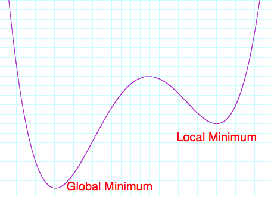

# Using Ngrams: Breaking Caesar Cyphers

In this project, you will learn

* How to implement a random walk
* How to read JSON files into Python objects
* How to test code with unittest

## Project: What Does This Say?

When Julius Caesar commanded the Roman 13th Legion, he needed a way to send orders to his generals that could not be read by the enemy. He developed a simple way of doing so by shifting letters. For example, a simple substitution of one means that instead of "A" he would write "B"; instead of "B", "C"; instead of "C", "D"; and so on. The substitution wraps, so instead of "Z" he would write "A".  Thus the word "CAESAR" becomes "DBFTBS". This basic technique is called a *Caesar Cipher*.

If you know you're looking at a Caesar cipher, then you can easily break it. All you need to know is what the shift is, such as shift by one, or shift by five letters. A slightly more sophisticated cipher is a substitution cipher, in which some letters just map to other letters, but not necessarily by a fixed shift. For example, "A" becomes "F", "B" becomes "T", "C" becomes "A", and so on. Breaking these ciphers is considerably more difficult, since there are far more than 26 possible different substitution ciphers. In fact, there are approximately {$$}4\times10^{26}{/$$} different substitution ciphers. That's 4, followed by 26 zeros, or 400 septillions!

The way to break such ciphers is to make use of the distribution of letters in the English language. In this project, you will break a cipher by using what you learned about pairs of letters in the previous project.

Your first task is to read the JSON file of letter pair frequencies that you created in the last project. Once you have this, write a function called `likelihood(s)` that computes the likelihood of a string being in the English language. For example, the likelihood of "the cat in the hat" should be very high, but the likelihood of gibberish such as "aj kdit aknoeihb eibs" should be very, very small.

Here is a way to compute the likelihood of a phrase like "cat". Use the known frequency of letter pairs to find the probability of the pair "ca", call that {$$}p_{ca}{/$$}. Similarly, look up the probability of "at" and call that {$$}p_{at}{/$$}. A good estimate for the likelihood is {$$}p_{ca} \times p_{at}{/$$}. Obviously, this generalizes to strings of arbitrary length.

The only problem with this approach for estimating likelihood is that it results in very small numbers. The probability of any given pair is very small, say 1%. So if you look at text that consists of 10 characters, the combined probability may be 0.00000000000000000001%. If you look at text that is the length of a typical letter, the probability is essentially zero. This wouldn't be a big problem, except that computers can only store numbers with a certain amount of precision, so very soon all text will just have probability zero, and you can never distinguish English from gibberish.

A clever solution to this problem is to scale the probabilities in some way. For example, using the square roots of the probabilities instead of the probabilities themselves will make all the likelihoods just slightly bigger and delay the problem. Ultimately, a better solution is to take the logarithm of the probabilities, because {$$}\log(p_{ca}p_{at}) = \log(p_{ca})+\log(p_{at}){/$$}. So not only do the probabilities of individual pairs become manageable (e.g., {$$}\log(0.00000000000000000001)=-20{/$$}), the products of the probabilities are replaced by sums, so the numbers stay in roughly the same magnitude. That means we can apply this approach to both short texts and long texts, so we can decipher tweets as well as *War and Peace*.

Next, you need a way to keep track of a "key" to decrypt a substitution cipher. This need only be a map from letters to letters, so a Python dictionary will work just fine. Write a function called `decrypt(text, key)` that decrypts the `text` using the given `key`. For example, the text "DBFTBS" with the key `{"A":"B", "B":"C", ..., "Z":"A"}` should decrypt to "CAESAR".

Using these functions, it's a simple matter to break a substitution cipher as follows. Start with a random substitution key, use the key to decrypt the text, and see how likely it is. After that, randomly change the substitution key by swapping two letters. For example, if "A" was encoded as "G" and "K" as "T", change the key so that "A" is encoded as "T" and "K" as "G" instead. Of course, you pick "A" and "K" randomly, so there are many possible new keys that you can generate. Just pick one. At this point, use the new key to decrypt the text and figure out how likely this new version is. Keep the substitution key that results in the most English-like text. If you do this enough times, you will end up with the correct substitution key.

As it turns out, you may find that you don't quite end up with the right substitution key, meaning that the decrypted text you end up with is not actual English at all.  What's happening is that the technique we're using amounts to an *optimization* technique, where we decide whether the previous key or the mutated key gets us closer to the final answer. This idea works in many cases, but in some cases it ends up stuck at a local minimum instead of finding the global minimum.  This is shown in Figure 5.1, where you can clearly see that the algorithm we described can get stuck in the local minimum to the right, and completely miss the true global minimum on the left.

One way to get around this problem is to choose the mutated key some times, even if it leads to a worse likelihood. Of course, we don't want to do this **all** the time. It makes sense to allow switching to a "worse" key in a way that considers the likelihoods of the resulting strings. For example, suppose the optimal (so far) key so far results in a *probability* of 0.75, but by changing two letters we end up with a key that results in a *probability* of only 0.25. Ordinarily, we would choose to keep the optimal (so far) key and forget about the new key. However, to avoid getting stuck in local minima, we'll want to keep the new key every once in a while. Since the new key is three times ({$$}0.75/0.25=3{/$$}) less likely than the optimal key, we should decide to switch to the new key only 1/3 of the time. Notice that if the new key is only slightly worse than the old one, we will nevertheless switch to the new key just a little less than 1/2 of the time. This approach is not the only possibility to avoid local minima, but it's definitely one that works well in practice.

Unlike previous projects, this project does not introduce any new Python techniques. So there's a good chance that you can just tackle it. But there are some tricks that may be new, so take a look at the rest of this chapter if you get stuck.

## Random Numbers

In this project, you will use random numbers for several different tasks:

* Configuring the initial substitution key, where each letter is mapped to a random letter,
* Choosing two letters to "swap" in order to make a new substitution key, and
* Deciding whether to switch to the new substitution key when it's not as good as the original key.

To use random numbers, first import the `random` module. This module contains many different functions related to random numbers. For example, the function `random.shuffle(l)` will randomly rearrange the items in the list `l`. This is illustrated in the code in Listing 5.1, where the list `l` will end up as some permutation of `[1, 2, 3, 4, 5]`, possibly but not necessarily `[1, 5, 4, 3, 2]`.

{title="Listing 5.1: Permuting a List Randomly", lang=python, line-numbers=on, starting-line-number=1}
~~~~~
import random

l = [1, 2, 3, 4, 5]
random.shuffle(l)
# l is now a permutation of [1, 2, 3, 4, 5], POSSIBLY [1, 5, 4, 3, 2]
~~~~~

You may be troubled by the fact that we cannot know the result of `random.shuffle(l)`. Such is the way of random numbers, and generally we are happy that there is no way to know the result. However, in some settings it is vital that we always get the same results, for example when describing examples in function docstrings. Python allows you to make random numbers totally predictable (in principle) by letting you set the random seed. In particular, if you call `random.seed(19483)`, or any other number instead of `19483`, you are forcing random to return a fixed sequence from that point on. There is no effective way of knowing what values random will return, so in a certain sense they way as well be random still, but you are guaranteed that from that point on, you will always get the same sequence. This is illustrated in Listing 5.2. 

{title="Listing 5.2: Permuting a List Deterministically", lang=python, line-numbers=on, starting-line-number=1}
~~~~~
import random

l = [1, 2, 3, 4, 5]
random.seed(19483)
random.shuffle(l)
# l is now GUARANTEED to be [1, 4, 2, 3, 5]
~~~~~

Why would you want to permute a list? This is a good way to initialize the random substitution key. For instance, start with a list containing `["a", "b", ..., "z", " ", "."]` and shuffle it. Then the letter `"a"` can map to the first element of that list, `"b"` to the second one, and so on.

Another useful function is `random.randint(a, b)`. This selects a random integer in the range from `a` to `b` *inclusive*. For example, if you call `random.ranint(1, 3)` a number of times, the function will return either 1, 2, or 3, each a third of the time. This can be used to select two letters to swap to make a new substitution cipher.

Finally, the function `random.random()` returns a random number between 0 and 1, such as `0.38737738176471215`. This is often used to decide between two alternatives with a certain probability. For example, if you wish to pick outcome 1 with a probability of 0.25, you can check that the value returned in a call to `random.random()` is less than or equal to 0.25. You will want to use this when you're deciding whether to switch to a new substitution key that is not quite as good as the last one.

## Swapping Two Variables

Swapping two variables is a task that is surprisingly difficult. For example, Listing 5.3 shows a common mistake.

{title="Listing 5.3: Swapping Two Variables Incorrectly", lang=python, line-numbers=on, starting-line-number=1}
~~~~~
x = 1
y = 2

x = y
y = x
~~~~~

The program in Listing 5.3 does *not* swap the values of `x` and `y`. The reason is that after Line 4, *both* `x` and `y` have the value 2, so Line 5 does essentially nothing. That is, the value 2 in `x` is stored in `y`, which was already 2.

What is needed to correct this is to somehow remember the old value of `x` before assigning the value of `y` to it. This is illustrated in Listing 5.4.

{title="Listing 5.4: Swapping Two Variables Correctly", lang=python, line-numbers=on, starting-line-number=1}
~~~~~
x = 1
y = 2

t = x
x = y
y = t
~~~~~

In Line 4, the variable `t` is introduced simply to keep the value of `x` before it is wiped with the value of `y` in Line 5. Then the variable `y` is assigned this saved value in Line 6, so it ends up with the original value of `x`. This works, with the caveat that we introduced a new temporary variable `x`, and it is very important that there cannot be another variable called `t` in the program!

The program in Listing 5.4 works, and it is the only way to swap two variables in most languages. As it turns out, Python offers a better way to swap variables, as seen in Listing 5.5.

{title="Listing 5.4: Swapping Two Variables Pythonically", lang=python, line-numbers=on, starting-line-number=1}
~~~~~
x = 1
y = 2

x, y = y, x
~~~~~

In Line 4, the values of `x` and `y` *together* are assigned the values of `y` and `x` *together*. What this means is that the value of `y` ends up in `x` and the value in `x` ends up in `y`. This is a very nice shorthand for swapping variables, and it is just one of the ways that the syntax of Python is designed to simplify common tasks.

## Copying a Deep Structure

There is a very big subtlety that comes up when you assign a complex structure, like a dictionary or a list, to a new variable. For example, suppose that `x` contains the list `["a", "b", "c"]` and you assign `x` to `y`. What is `y[1]`? I'm sure you agree that it must have the letter `"b"`. But what happens if you change `y[1]` to `"fred"`? Then, obviously, `y[1]` now has the value `"fred"`. So far so good. But now, what is the value of `x[1]`?

If you guessed `"fred"`, then you know the problem we are describing. This is seen in Figure 5.2, which illustrates what happens immediately after `x` is assigned to `y`. As you can see from the graph, after the assignment `x` and `y` are both referring to the *same* list, so changing an entry in `x` will necessarily change the corresponding entry in `y` and vice versa.

If you want `y` to have its own *copy* of the list (or dictionary) that `x` refers to, so that changes in `y` are *not* propagated in `x`, then you need a situation like the one shown in Figure 5.3. But that means that you must copy each element in `x` to a new list in `y`, as shown in Listing 5.5.

{title="Listing 5.5: Copying the Elements of a List", lang=python, line-numbers=on, starting-line-number=1}
~~~~~
x = [1, 2, 3, 4, 5]

y = []
for e in x:
    y.append(e)
~~~~~

After the code in Listing 5.5 is executed, `x` and `y` will both refer to a list containing the numbers 1, 2, 3, 4, and 5. However, `x` and `y` will refer to *different* list with those elements, as seen in Figure 5.3, so that changes to `y` will not be reflected back in `x` or vice versa.

Unfortunately, simply copying each element as shown in Listing 5.5, is not enough. The reason is that complex objects, like lists and dictionaries, may contain complex objects inside, such as list inside a list or a list inside a dictionary. Simply copying the elements will result in a new outer list, but both the original list and the copy may still be referring to the same elements. In other words, changes to `x[1]` may still show up in `y[1]`. This situation is illustrated in Figure 5.4. Given the the situation shown in that figure, changing the value of `x[1]["b"]` will *also* necessarily change the value in `y[1]["b"]`.

As you can see from Figure 5.4, assigning a deep structure from one variable to another in such a way that each variable has its own entire copy is not an easy proposition. You *could* write a function to do it, but luckily Python provides a simple mechanism. Just use `x.copy()` to create a *copy* of `x` and assign that to `y`. This is shown in Listing 5.6.

{title="Listing 5.6: Copying a List Pythonically", lang=python, line-numbers=on, starting-line-number=1}
~~~~~
x = [1, [2, 3, 4], 5]

y = x.copy()
~~~~~

After the code in Listing 5.6, changes to `y` or its elements will not be reflected in `x` or vice versa, because `x` and `y` will refer to two different copies of the object, and each element in those lists will also refer to different copies. Specifically, the second element of `x`, which is the nested list `[2, 3, 4]`, will also have a *different* copy in `y`.

## Testing Code

Earlier, we tested code by placing examples in the docstring of a function. This works well for functions like `is_prime(n)`, where the examples give a clear description of how working code should behave. But this approach runs into limitations as the code gets bigger and more complex. For example, testing a function that returns a Python dictionary is particularly difficult, and testing functions that use random numbers is practically impossible.

So we will now consider a different way of testing. The idea is to write **new** code that can test the code you're working on. Python provides the module `unittest` that makes writing testing code relatively easy. But to understand how to use `unittest`, we have to revisit Python classes.

### Classes and Inheritance

We first explored classes in Chapter 4, where we refactored the NGram code into its own class. At the time, we focused on the way classes help us organize code, but we mentioned that another aspect of classes is how they help us reuse code. That is our focus now. Writing testing code is conceptually easy, e.g., just check if calling a function with some given arguments returns an expected value. But it involves a lot of tedious details that we would prefer not to deal with, for example generating a reports that shows which tests passed and which did not. What we want is to reuse the tedious code, so that all we have to write are the things that are actually pertinent to a specific test. That's the point of code reuse.

So a Python class can reuse code in another class in two ways. The first is simply to create an instance of the other class and call its methods. For example, in the current project you can have a `Cypher` class that keeps track of an encryption key and provides methods to encode a string, and a separate `CodeBreaker` class that figures out how to break a substitution cypher. The `CodeBreaker` class would call the methods of the `Cypher` class, e.g., the encode method.

The second way is called **inheritance**. The idea is the a class can inherit behavior from another class, in which case we say that a subclass inherits from a superclass. We indicate that a class inherits from a superclass in the `class` definition statement, as in Listing 5.7.

{title="Listing 5.7: Declaring Inheritance from a Superclass", lang=python, line-numbers=on, starting-line-number=1}
~~~~~
class SubClass (SuperClass):
    ...
~~~~~

The way inheritance works is like this. Suppose that `SuperClass` defines a method `m1()`, so that if you have an instance `sup` of `SuperClass` you can call `sup.m1()`. Now, suppose that `sub` is an instance of `SubClass`. Then `sub` **inherits** the definition of `m1()` from `SuperClass`, so you can also call `sub.m1()`. The code in `m1()` from `SuperClass` is reused in `SubClass`.

The same is true of variables. For example, suppose that `SuperClass` declares a variable `self.x` so that the `sup` instance can refer to `sup.x`. Then `sub`, a member of the `SubClass`, can also refer to `sub.x`.

Let's take a look at a concrete example. Suppose you're writing a program that takes care of payroll for a small company. The program may have a class to model an `Employee`. Each `Employee` would have a name, address, social security number, and direct deposit information. In addition, the `Employee` class would have a method that deposits the payroll on the `Employee`'s bank. Listing 5.8 shows the skeleton of the `Employee` class.

{title="Listing 5.8: Declaring a Superclass", lang=python, line-numbers=on, starting-line-number=1}
~~~~~
class Employee:
    def __init__(self, name, address, ssn, deposit):
        self.name = name
        self.address = address
        self.ssn = ssn
        self.deposit = deposit
        ...
    def direct_deposit(self):
        """Transfer monthly earnings to deposit info"""
        ...
~~~~~

But suppose that there are two types of employees in the company, salaried and hourly employees. To handle this, the program may have two subclasses of `Employee`. The `SalariedEmployee` subclass would have a field called `salary`, and the `HourlyEmployee` subclass would have the fields `hourly_rate` and `hours_worked`. Moreover, both subclasses would have a method called `monthly_salary()` that computes that employee's monthly salary. This is shown in Listing 5.9.

{title="Listing 5.9: Declaring Subclasses", lang=python, line-numbers=on, starting-line-number=1}
~~~~~
class HourlyEmployee (Employee):
    def __init__(self, hourly_rate, hours_worked):
        self.hourly_rate = hourly_rate
        self.hours_worked = hours_worked
        ...
    def monthly_salary(self):
        return self.hours_worked * self.hourly_rate

class SalariedEmployee (Employee):
    def __init__(self, salary):
        self.salary = salary
        ...
    def monthly_salary(self):
        return self.salary / 12
~~~~~

Now, suppose that `emp` is an instance of `Employee`. Then you can access the name of the employee by using `emp.name`, and you can pay the employee by calling `emp.direct_deposit()`. Moreover, suppose that `emp` is actually either a `SalariedEmployee` or an `HourlyEmployee`. Then you can find his or her monthly salary by calling `emp.monthly_salary()`. Of course, it would be a mistake to look for `emp.salary`, since `emp` could be an `HourlyEmployee`, in which case it won't have a `salary` field. The important point here is that if `emp` is an instance of one of the subclasses, then you can call the methods of either the superclass or the specific subclass it belongs to. The methods and variables from the superclass are seamlessly inherited from the superclass.

But suppose that the behavior from the superclass isn't exactly appropriate for the subclass. In that case, the subclass can simply define its own method. For example, suppose that some hourly employees are eligible for overtime. Then we can define a subclass of `HourlyEmployee` with an alternative definition of `monthly_salary()` as shown in Listing 5.10.

{title="Listing 5.10: Overriding Methods", lang=python, line-numbers=on, starting-line-number=1}
~~~~~
class HourlyOvertimeEmployee (HourlyEmployee):
    def __init__(self, hourly_rate, hours_worked):
        self.hourly_rate = hourly_rate
        self.hours_worked = hours_worked
        ...
    def monthly_salary(self):
        if self.hours_worked > 160:
            return self.hours_worked * self.hourly_rate +
                   (self.hours_worked - 160) * self.hourly_rate / 2
        else:
            return self.hours_worked * self.hourly_rate
~~~~~

Now if `emp` happens to be a `HourlyOvertimeEmployee`, when `emp.monthly_salary()` is called, it is the method defined in `HourlyOvertimeEmployee` that is actually executed. However, if `emp` is an `HourlyEmployee` but not an `HourlyOvertimeEmployee`, the method that is executed is the one defined in `HourlyEmployee`.

What Python is doing is looking for the `monthly_salary()` in the actual class of `emp`. If it finds such a method there, then that method is executed. On the other hand, if the class does not define the method, then Python looks in the immediate superclass and tries again. This process is repeated until Python finds a class that defines the method, and is called **inheritance**. The new wrinkle is that if a subclass defines a method that is also defined in the superclass, then following the process above, Python will find the method of the subclass and execute that one instead of the one from the superclass. This is called **overriding**, and it refers to the fact that the subclass can completely redefine the behavior specified in the superclass.

If you're reading carefully, you may be worried by the description of overriding. What happens, for example, to the `__init__()` method? When you create an `HourlyEmployee`, the `__init__()` method of `HourlyEmployee` must be getting called. But what about `__init__()` from `Employee`?

In some programming languages, the `__init__()` method from the superclass will also be called, but this it not the case in Python. According to the rules for overriding, the `__init__()` method of `HourlyEmployee` overrides the `__init__()` method of `Employee` which is therefore not called. This may be fine some of the time, but it's actually a serious problem in the code. If the `__init__()` method of `Employee` is not called, where is `self.name` initialized, for example?

Python provides a mechanism to allow an instance of a subclass to call an overridden method from the superclass. To do this, simply call `super().method(...)` in the subclass, and the actual `method(...)` implementation that is called will be the one defined in the superclass. For example, to ensure that the `__init__()` method of `Employee` is called, the subclasses should be defined as in Listing 5.11. Notice that the call to `super().__init__()` has the arguments needed to initialize an `Employee`, so these were also added to the arguments for `__init__()` in each of the subclasses. In general, the subclass needs to have enough information to properly initialize the superclass.

{title="Listing 5.11: Calling Overridden Methods", lang=python, line-numbers=on, starting-line-number=1}
~~~~~
class HourlyEmployee (Employee):
    def __init__(self, name, address, ssn, deposit, hourly_rate, hours_worked):
        super().__init__(name, address, ssn, deposit)
        self.hourly_rate = hourly_rate
        self.hours_worked = hours_worked
        ...
    def monthly_salary(self):
        return self.hours_worked * self.hourly_rate

class SalariedEmployee (Employee):
    def __init__(self, name, address, ssn, deposit, salary):
        super().__init__(name, address, ssn, deposit)   
        self.salary = salary
        ...
    def monthly_salary(self):
        return self.salary / 12
~~~~~

To summarize the key points, the superclass provides some behavior that can be reused by the subclasses, e.g., `direct_deposit()`. The subclasses, in turn, can provide some new behavior of their own that is totally unknown to the parent class, for example the `hourly_rate` of a `SalariedEmployee`. They can also provide different implementations of behavior that is in common to all subclasses, as with `monthly_salary()`. Subclasses can override methods defined in a superclass, and this allows a subclass to provide a behavior that is more appropriate than the default behavior specified in the superclass, as in `monthly_salary()` of the `HourlyOvertimeEmployee` class. When a method is overridden, Python will call the implementation in the subclass instead of the one in the superclass. But it is still possible to call the implementation of the superclass explicitly by using `super()`, and this is particularly important for the `__init__()` method.

### Python's Unittest

The Python `unittest` module provides a sophisticated framework for testing classes and functions. The key component is the class `unittest.TestCase` that simplifies the process of testing by taking care of the routine tasks of testing, like generating a report of the test results, so you can concentrate on the actual tests.

To use `unittest`, you should break your testing scenarios into test cases, which correspond to a coherent unit of testing, e.g., a single test case may be used to test a single class or a group of closely related functions. Each test case inherits from the class `unittest.TestCase` and by convention the test case class should end in `End`.

A test case should have one test method for each separate test that should be performed. You could put all the tests in a single method, but you should use a separate test method for each method of the original class you want to test. By convention, the name of each test method should start with `test_`. For example, if you have a class called `HourlyEmployeeTest`, then you should at the very least have a method called `test_monthly_salary()`. In addition, you may have other test methods to test special scenarios. For example, you can have a test that checks the code does something reasonable when the number of hours is negative or greater than the number of hours in 100 years. Listing 5.12 shows a sample test case.

{title="Listing 5.12: A Test Case", lang=python, line-numbers=on, starting-line-number=1}
~~~~~
import unittest

class HourlyEmployeeTest (unittest.TestCase):
    def test_monthly_salary(self):
        emp = HourlyEmployee ("Sally", "1 Main St", "567-89-1234", 
                              "First Global Bank Acct #11122", 
                              15.00, 80)
        self.assertEqual(emp.monthly_salary(), 1200.0)
        emp2 = HourlyEmployee ("Fred", "100 S. 32nd St", "456-78-9012", 
                               "Second Global Bank Acct #34567", 
                               10.00, 40)
        self.assertEqual(emp2.monthly_salary(), 400.0)
~~~~~

After writing the tests, you can have `unittest` run through all of them by calling `unittest.main()`. This will generate a report that will let you know how many tests were run, and the results of the tests.